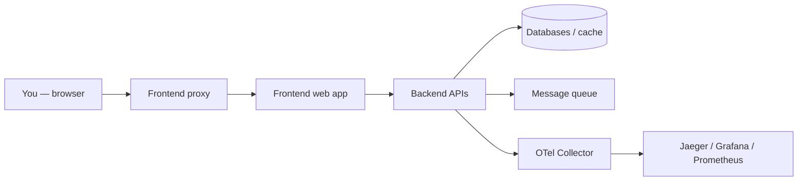
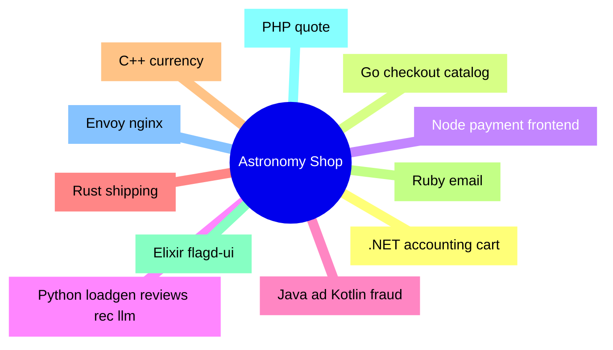
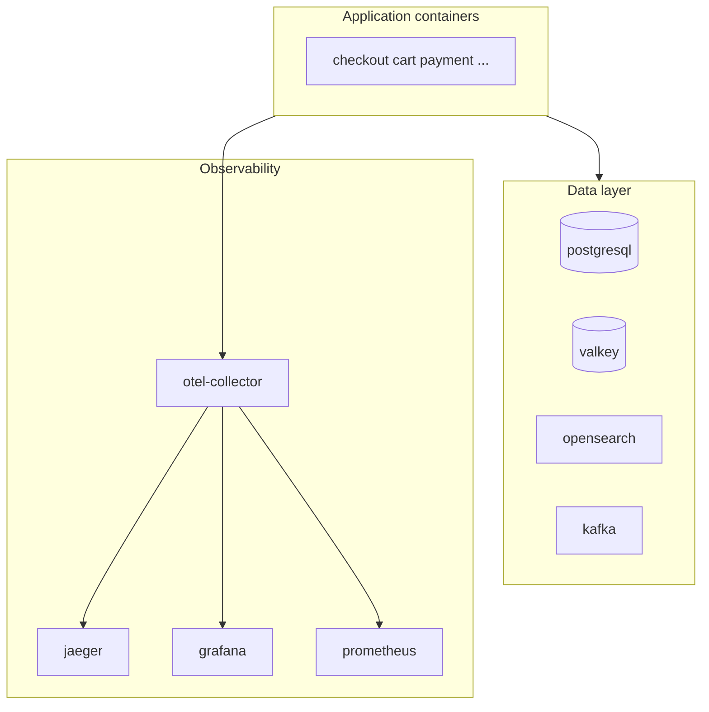

# The OpenTelemetry Astronomy Shop: what this project actually is

Welcome to the first chapter. Here I introduce the <Highlight color="blue">real product</Highlight> behind all the build-system work: the <Highlight color="orange">OpenTelemetry Astronomy Shop Demo</Highlight>. Once you know what the app is and which pieces exist, the later chapters about <Highlight color="purple">Bazel</Highlight> will make sense. I explain terms as we go, keep the language plain, and use diagrams so you can “see” the system.

<DocImage
  src="/assets/docs/knowledge-base/bazel-integration/01-astronomy-shop-homepage.png"
  alt="OpenTelemetry Astronomy Shop demo homepage"
  caption="Homepage of the Astronomy Shop demo in the browser."
/>

---

## In one breath: what is OpenTelemetry?

**OpenTelemetry** (often shortened to **OTel**) is an open standard and a set of tools to **observe** software that runs in many places at once.

- **Observe** here means: collect <Highlight color="yellow">signals</Highlight> about what the code is doing — mainly <Highlight color="yellow">traces</Highlight> (request paths through services), <Highlight color="yellow">metrics</Highlight> (numbers over time), and <Highlight color="yellow">logs</Highlight>.
- It is **not** a single database or a single vendor product. It is a **common way** to export that data so tools like **Jaeger**, **Grafana**, **Prometheus**, and many others can use it.

<Callout type="note" title="Simple analogy">
Imagine a shop with many employees. OpenTelemetry is like giving everyone the **same kind of name tag and logbook** so, when something goes wrong, you can follow a customer’s order from the door to the stock room without guessing who touched it.
</Callout>

---

## What is the “Astronomy Shop”?

The **OpenTelemetry Astronomy Shop** is a <Highlight color="green">fake online store</Highlight> that sells space-themed products. It lives inside the Git repository called **OpenTelemetry Demo** (upstream: `open-telemetry/opentelemetry-demo`). This fork is the same demo, plus my **Bazel** migration work.

<Callout type="info" title="Fork for this Bazel series">
The code for this write-up is on GitHub: [adamBoualleiguie/opentelemetry-demo-basel-integration](https://github.com/adamBoualleiguie/opentelemetry-demo-basel-integration) (`git clone` in the terminal section below uses this URL).
</Callout>

The official README says it clearly:

<Callout type="info" title="From the upstream README">
A **microservice-based distributed system** meant to show how **OpenTelemetry** looks in a setup that feels close to the real world — not a toy “hello world”, but many services talking to each other.
</Callout>

**Three goals** the upstream project states (I’m paraphrasing in simpler words):

1. **Show** realistic instrumentation and observability.
2. **Let** vendors and tool makers plug in their products on top of a shared example.
3. **Give** OTel contributors a living app to test new versions.

So: it is a <Highlight color="blue">learning and demo vehicle</Highlight>, but a **serious** one — big enough to hurt if you try to build it wrong, which is exactly why it is a great place to learn **Bazel**.

---

## Quick terms (you will see them everywhere)

<table>
  <thead>
    <tr>
      <th>Term</th>
      <th>Plain meaning</th>
    </tr>
  </thead>
  <tbody>
    <tr>
      <td><strong>Microservice</strong></td>
      <td>A small program that does <strong>one main job</strong> (e.g. “take payment”). Many microservices together form the full app.</td>
    </tr>
    <tr>
      <td><strong>Monorepo</strong></td>
      <td><strong>One Git repository</strong> that holds many services and shared code (this demo is a monorepo).</td>
    </tr>
    <tr>
      <td><strong>Docker Compose</strong></td>
      <td>A file (<code>docker-compose.yml</code>) that says “start these containers together” so you can run the whole shop on your laptop.</td>
    </tr>
    <tr>
      <td><strong>Container</strong></td>
      <td>A packaged runtime: your service + its dependencies, isolated from the rest of the machine.</td>
    </tr>
    <tr>
      <td><strong>Instrumentation</strong></td>
      <td>Code or libraries that <strong>automatically record</strong> spans, metrics, etc., and send them to the collector.</td>
    </tr>
    <tr>
      <td><strong>OpenTelemetry Collector</strong></td>
      <td>A hub service that <strong>receives</strong> telemetry from apps, can process it, and <strong>exports</strong> it to Jaeger, Prometheus, etc.</td>
    </tr>
    <tr>
      <td><strong>Feature flags</strong></td>
      <td>Toggle behavior without redeploying everything; here <strong>flagd</strong> helps turn features on/off for demos.</td>
    </tr>
    <tr>
      <td><strong>Bazel</strong></td>
      <td>A build system that knows a <strong>dependency graph</strong> and rebuilds only what changed. This series teaches it <strong>through</strong> this shop repo.</td>
    </tr>
  </tbody>
</table>

---

## What does the user actually do in the demo?

A person opens the **web UI** (the **frontend**). They browse products, add to cart, check out, maybe leave a review. Behind each click, **many services** run: catalog, cart, payment, shipping, email, and more. Each step can emit <Highlight color="yellow">traces</Highlight> so you can watch the story in **Jaeger** or dashboards in **Grafana**.

<DocImage
  src="/assets/docs/knowledge-base/bazel-integration/01-request-flow-through-services.png"
  alt="Request flow from browser through frontend proxy, APIs, data layer, and observability"
  caption="How a typical request flows through the demo stack."
/>

---

## Application services (the “shop” code)

These are the **main programs** under `src/` that implement business logic. I list the **Compose service name**, **role in one line**, **typical language**, and **folder** so you can open the code.

<table>
  <thead>
    <tr>
      <th>Service (Compose)</th>
      <th>What it does (short)</th>
      <th>Language / stack</th>
      <th>Code folder</th>
    </tr>
  </thead>
  <tbody>
    <tr>
      <td><strong>accounting</strong></td>
      <td>Money / accounting side of orders</td>
      <td>.NET</td>
      <td><code>src/accounting</code></td>
    </tr>
    <tr>
      <td><strong>ad</strong></td>
      <td>Serves ads (demo content)</td>
      <td>Java</td>
      <td><code>src/ad</code></td>
    </tr>
    <tr>
      <td><strong>cart</strong></td>
      <td>Shopping cart</td>
      <td>.NET</td>
      <td><code>src/cart</code></td>
    </tr>
    <tr>
      <td><strong>checkout</strong></td>
      <td>Checkout flow, talks to Kafka, etc.</td>
      <td>Go</td>
      <td><code>src/checkout</code></td>
    </tr>
    <tr>
      <td><strong>currency</strong></td>
      <td>Currency conversion</td>
      <td>C++</td>
      <td><code>src/currency</code></td>
    </tr>
    <tr>
      <td><strong>email</strong></td>
      <td>Sends email notifications</td>
      <td>Ruby</td>
      <td><code>src/email</code></td>
    </tr>
    <tr>
      <td><strong>fraud-detection</strong></td>
      <td>Fraud checks</td>
      <td>Kotlin (JVM)</td>
      <td><code>src/fraud-detection</code></td>
    </tr>
    <tr>
      <td><strong>frontend</strong></td>
      <td>Web UI (Next.js style app)</td>
      <td>Node / TypeScript</td>
      <td><code>src/frontend</code></td>
    </tr>
    <tr>
      <td><strong>frontend-proxy</strong></td>
      <td>Entry proxy (Envoy)</td>
      <td>Envoy config</td>
      <td><code>src/frontend-proxy</code></td>
    </tr>
    <tr>
      <td><strong>image-provider</strong></td>
      <td>Serves images (nginx)</td>
      <td>nginx</td>
      <td><code>src/image-provider</code></td>
    </tr>
    <tr>
      <td><strong>load-generator</strong></td>
      <td>Synthetic traffic</td>
      <td>Python</td>
      <td><code>src/load-generator</code></td>
    </tr>
    <tr>
      <td><strong>payment</strong></td>
      <td>Payments</td>
      <td>Node</td>
      <td><code>src/payment</code></td>
    </tr>
    <tr>
      <td><strong>product-catalog</strong></td>
      <td>Product list / details</td>
      <td>Go</td>
      <td><code>src/product-catalog</code></td>
    </tr>
    <tr>
      <td><strong>product-reviews</strong></td>
      <td>Reviews</td>
      <td>Python</td>
      <td><code>src/product-reviews</code></td>
    </tr>
    <tr>
      <td><strong>quote</strong></td>
      <td>Shipping cost quotes</td>
      <td>PHP</td>
      <td><code>src/quote</code></td>
    </tr>
    <tr>
      <td><strong>recommendation</strong></td>
      <td>Recommendations</td>
      <td>Python</td>
      <td><code>src/recommendation</code></td>
    </tr>
    <tr>
      <td><strong>shipping</strong></td>
      <td>Shipping logic</td>
      <td>Rust</td>
      <td><code>src/shipping</code></td>
    </tr>
    <tr>
      <td><strong>flagd</strong></td>
      <td>Feature flag backend (runtime image from upstream demo)</td>
      <td>Config in repo</td>
      <td><code>src/flagd</code> (e.g. <code>demo.flagd.json</code>)</td>
    </tr>
    <tr>
      <td><strong>flagd-ui</strong></td>
      <td>UI for feature flags</td>
      <td>Elixir / Phoenix</td>
      <td><code>src/flagd-ui</code></td>
    </tr>
    <tr>
      <td><strong>llm</strong></td>
      <td>LLM-related demo piece</td>
      <td>Python</td>
      <td><code>src/llm</code></td>
    </tr>
  </tbody>
</table>

That is **a lot of languages in one repo**. That is the point: the demo proves OpenTelemetry across ecosystems — and for me it became the perfect <Highlight color="orange">stress test</Highlight> for Bazel.

<DocImage
  src="/assets/docs/knowledge-base/bazel-integration/01-language-mindmap-slide.png"
  alt="Mind map of languages and areas in the Astronomy Shop repo"
  caption="Polyglot layout of the demo (mind map)."
/>

---

## Infrastructure and observability services

`docker-compose.yml` also starts **databases**, **queues**, and **observability** stacks. They are not “the shop” in a business sense, but the demo does not run without them.

<table>
  <thead>
    <tr>
      <th>Service</th>
      <th>Plain role</th>
    </tr>
  </thead>
  <tbody>
    <tr>
      <td><strong>kafka</strong></td>
      <td>Message streaming (checkout and friends use it).</td>
    </tr>
    <tr>
      <td><strong>postgresql</strong></td>
      <td>Relational database.</td>
    </tr>
    <tr>
      <td><strong>valkey-cart</strong></td>
      <td>In-memory store for cart data (Redis-class).</td>
    </tr>
    <tr>
      <td><strong>opensearch</strong></td>
      <td>Search / analytics backend used in the demo setup.</td>
    </tr>
    <tr>
      <td><strong>flagd</strong></td>
      <td>Feature flags service (paired with <strong>flagd-ui</strong>).</td>
    </tr>
    <tr>
      <td><strong>otel-collector</strong></td>
      <td>Receives telemetry from apps; <Highlight color="blue">heart of the OTel story</Highlight>.</td>
    </tr>
    <tr>
      <td><strong>jaeger</strong></td>
      <td>Trace UI (follow one request across services).</td>
    </tr>
    <tr>
      <td><strong>grafana</strong></td>
      <td>Dashboards.</td>
    </tr>
    <tr>
      <td><strong>prometheus</strong></td>
      <td>Metrics collection / querying.</td>
    </tr>
  </tbody>
</table>

---

## How people usually run the demo (without Bazel yet)

Most contributors use **Docker Compose** and **Make**:

<Terminal
  title="Clone this fork and run with Make"
  commands={[
    {
      command:
        'git clone https://github.com/adamBoualleiguie/opentelemetry-demo-basel-integration.git',
      output: "Cloning into 'opentelemetry-demo-basel-integration'...",
    },
    {
      command: 'cd opentelemetry-demo-basel-integration',
      output: '',
    },
    {
      command: 'make start',
      output: '# or follow upstream docs for docker compose',
    },
  ]}
/>

That path builds images from **Dockerfiles** and starts the stack. **This still works** in my fork. I did not replace “run the shop” with Bazel — I **added** Bazel so the same code can also be built and tested through <Highlight color="purple">one build graph</Highlight>.

---

## What *this* series is about (short)

This knowledge base walks through **that Bazel layer**:

- how the repo is wired as a <Highlight color="blue">Bazel workspace</Highlight>,
- how **each language family** hooks in,
- how **container images** are built with <Highlight color="orange">rules_oci</Highlight>,
- how **CI** runs the same commands I run locally.

I write it like a **project walkthrough** you could publish on a site: diagrams, commands, and “here is what this term means” — not a pile of pointers to other files. Later chapters go deeper; this chapter is only the **map of the territory**.

---

## Who this is for

- You want to **learn Bazel** on a <Highlight color="green">real polyglot</Highlight> repo, not a five-file tutorial.
- You already know **Docker** or **Make** a little — enough to follow commands.
- You are okay with **I**-style narration: I’m sharing how **I** approached the migration, not writing corporate policy.

If you have never heard of Bazel, stay with this series: **chapter 04** introduces the core ideas in plain language. **Chapter 02** describes what the repo looked like **before** Bazel owned the build graph.
