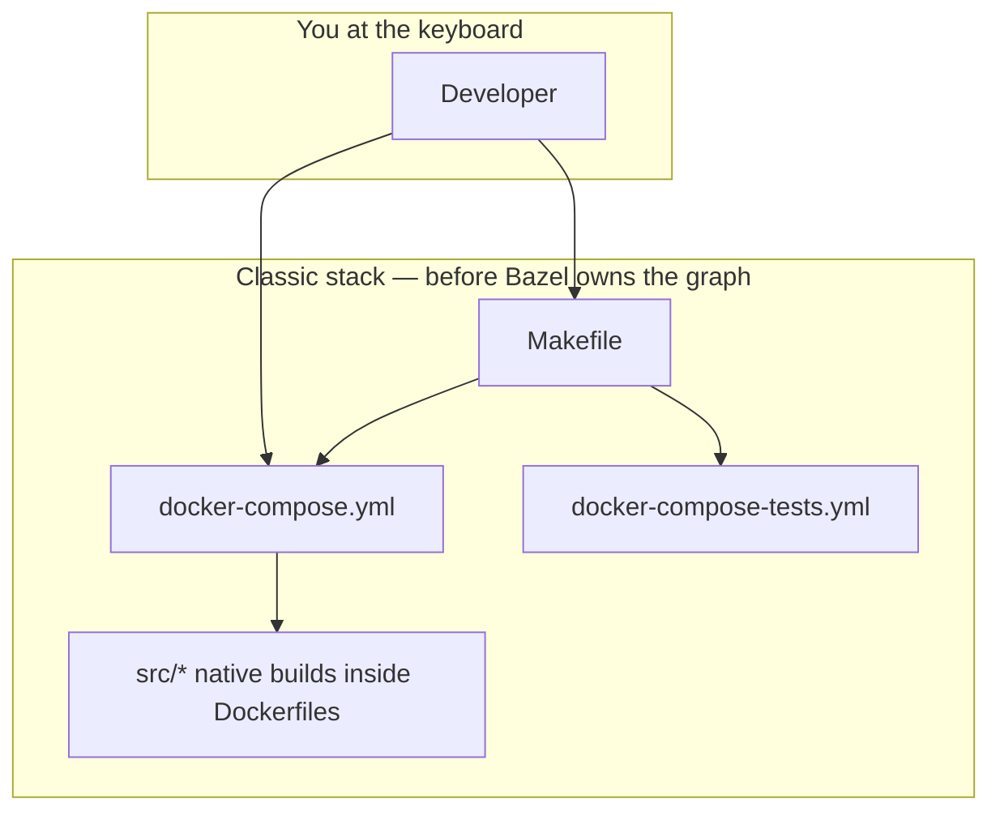
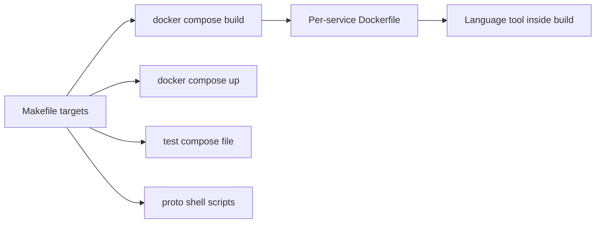
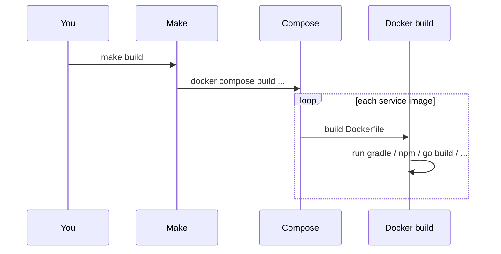
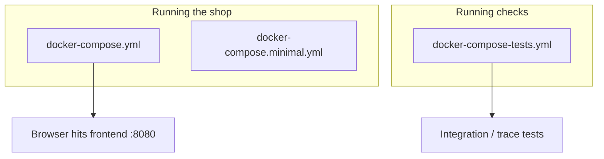
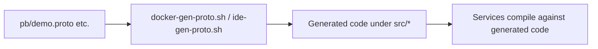
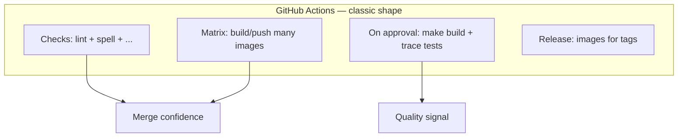
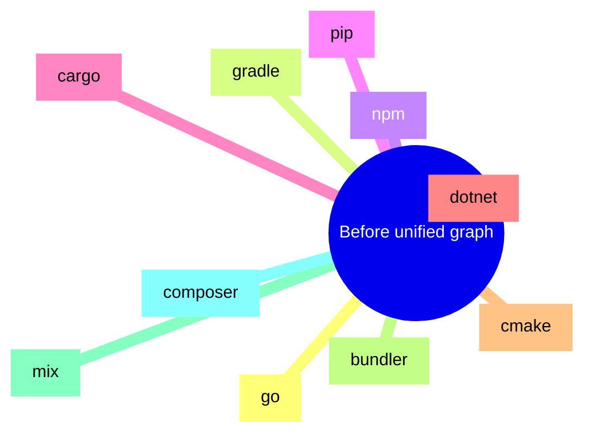
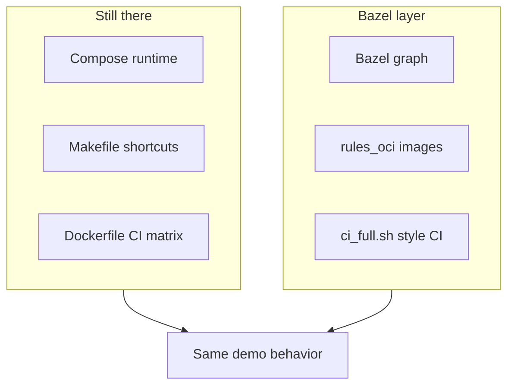

# How the Astronomy Shop repo worked **before** Bazel

In [chapter 01](/docs/Knowledge-base/projects/Bazel-integration/01-the-opentelemetry-astronomy-shop-demo) we met the **Astronomy Shop** itself: many services, many languages, Docker Compose, observability stack. This chapter is about **how that repo was actually built and tested** in the “classic” setup — the one that was already there when I started adding Bazel.

Think of it as a <Highlight color="blue">backstage tour</Highlight>: same show, but now we look at ropes, pulleys, and the fact that fifteen different build tools never signed a contract with each other.

I keep the language simple, drop diagrams everywhere, and **spell out terms** when they first appear. By the end you should know <Highlight color="orange">exactly</Highlight> what problem Bazel is meant to solve here — without me telling you to “go read another PDF”.

<DocImage
  src="/assets/docs/knowledge-base/bazel-integration/02-backstage-make-compose.png"
  alt="Backstage view of Make and Docker Compose driving the repo"
  caption="Classic stack: Makefile and Compose as the main control surface."
/>

---

## The big picture in one sentence

**Before Bazel, the repo was driven by a root `Makefile` + `docker compose` + per-service native tools (Gradle, npm, Cargo, …). CI mostly meant “build a lot of Docker images and run trace tests” — not “walk one unified build graph”.**

That worked for the community demo. It is also **messy** if you want one tool to understand <Highlight color="purple">the whole monorepo</Highlight> at once.



---

## What “orchestration” means here

**Orchestration** = who decides **what runs, in what order**.

In this project, **no single engine** knew “if I change file X, rebuild Y and Z”. Instead:

<table>
  <thead>
    <tr>
      <th>Layer</th>
      <th>Role in plain words</th>
    </tr>
  </thead>
  <tbody>
    <tr>
      <td><strong>Makefile</strong></td>
      <td>Friendly <strong>entry menu</strong>: <code>make build</code>, <code>make start</code>, <code>make check</code>, protobuf helpers, etc.</td>
    </tr>
    <tr>
      <td><strong>Docker Compose</strong></td>
      <td>“Start these <strong>containers</strong> together with these <strong>images</strong>.”</td>
    </tr>
    <tr>
      <td><strong>Dockerfiles</strong></td>
      <td>Each service’s <strong>recipe</strong> for installing deps and compiling <strong>inside</strong> the image build.</td>
    </tr>
    <tr>
      <td><strong>Language tools</strong></td>
      <td>Gradle, <code>dotnet</code>, <code>cargo</code>, <code>npm</code>, Composer, Mix, <code>pip</code>, … each inside its own world.</td>
    </tr>
  </tbody>
</table>

So the **real** dependency graph lived partly in **Compose `depends_on`**, partly in **Dockerfile steps**, partly in your head.



---

## The root `Makefile` (your main remote control)

The Makefile is not magic — it is mostly **shortcuts** so you do not memorize long `docker compose ...` lines. It also wires **repo hygiene** (spelling, markdown, licenses).

**Terms:**

- **Target** (Make sense): a name you type after `make`, like `make build`.
- **`.PHONY`**: tells Make “this is not a file named `build`”.

Things contributors actually use:

<table>
  <thead>
    <tr>
      <th>Command</th>
      <th>What it does (simple)</th>
    </tr>
  </thead>
  <tbody>
    <tr>
      <td><code>make build</code></td>
      <td>Runs <strong><code>docker compose build</code></strong> with the repo’s env files (<code> .env</code>, <code>.env.override</code>).</td>
    </tr>
    <tr>
      <td><code>make start</code></td>
      <td><strong><code>docker compose up -d</code></strong> — starts the full demo (UI on port 8080, Jaeger, Grafana links printed).</td>
    </tr>
    <tr>
      <td><code>make stop</code></td>
      <td>Brings the stack down (and test compose too).</td>
    </tr>
    <tr>
      <td><code>make check</code></td>
      <td>Runs <strong>misspell → markdownlint → license check → linkspector</strong> in order.</td>
    </tr>
    <tr>
      <td><code>make run-tests</code></td>
      <td>Uses <strong><code>docker-compose-tests.yml</code></strong>: frontend tests container, then <strong>trace-based</strong> tests.</td>
    </tr>
    <tr>
      <td><code>make run-tracetesting</code></td>
      <td>Same test compose file, <strong>traceBasedTests</strong> service (optional <code>SERVICES_TO_TEST</code>).</td>
    </tr>
    <tr>
      <td><code>make docker-generate-protobuf</code></td>
      <td>Runs <strong><code>./docker-gen-proto.sh</code></strong> — regenerates protobuf outputs in a controlled way.</td>
    </tr>
    <tr>
      <td><code>make generate-protobuf</code></td>
      <td>Runs <strong><code>./ide-gen-proto.sh</code></strong> — IDE-oriented proto generation.</td>
    </tr>
    <tr>
      <td><code>make clean</code></td>
      <td>Deletes <strong>known generated</strong> proto folders under some <code>src/</code> paths (Go genproto, Python pb2, frontend TS protos).</td>
    </tr>
  </tbody>
</table>

Example of what `make build` really is (conceptually):

```makefile
build:
	docker compose --env-file .env --env-file .env.override build
```

So: **Make does not compile Go**. It asks Docker to build images whose Dockerfiles compile Go.

<Terminal
  title="What make build delegates to"
  commands={[
    {
      command: 'make build',
      output:
        '# invokes: docker compose --env-file .env --env-file .env.override build',
    },
  ]}
/>



<DocImage
  src="/assets/docs/knowledge-base/bazel-integration/02-make-build-sequence.png"
  alt="Sequence diagram: Make to Compose to Docker build per service"
  caption="How a single make build fans out into per-image Docker builds."
/>

---

## Three Compose files you should know

1. **`docker-compose.yml`** — the **main** Astronomy Shop: app services + databases + Kafka + observability (Jaeger, Grafana, Prometheus, OTel Collector, …).
2. **`docker-compose.minimal.yml`** — a **smaller** slice for machines that cannot run everything.
3. **`docker-compose-tests.yml`** — **automated tests** as containers (e.g. Cypress-style frontend tests, **Tracetest**-style trace checks).

**Tracetest** (in this context): tests that hit the running system and assert things about **distributed traces** — very on-brand for OpenTelemetry.



---

## Where the code lives (`src/`, shared proto, tools)

- **`src/<service>/`** — one folder per service (or infra piece): its source, its **Dockerfile** (often selected via env vars in Compose), sometimes its own `package.json`, `Cargo.toml`, etc.
- **`pb/`** — shared **Protocol Buffers** definitions; many services speak gRPC using the same messages.
- **`internal/tools/`** — small **Go** tools the Makefile builds for misspell / addlicense.
- **Root `package.json`** — Node tooling for **repo-wide** checks (markdownlint, linkspector, …).

**Protobuf recap:** a `.proto` file describes message shapes and RPCs. Code generators turn that into **Go structs**, **Java classes**, **Python modules**, etc. If those generated files get **out of sync**, builds look fine until runtime explodes — so the repo has **scripts** and CI checks around generation.

---

## How protobufs were handled (the classic path)

Two shell scripts show up everywhere:

- **`docker-gen-proto.sh`** — generate via Docker so everyone gets the **same** toolchain versions.
- **`ide-gen-proto.sh`** — friendlier for **local IDE** workflows.

The Makefile exposes them as `make docker-generate-protobuf` and `make generate-protobuf`.

There is also a **cleanliness** idea: run generation, then ensure **Git** shows no surprise diffs (the Makefile has a `check-clean-work-tree` style guard used in CI flows around protos).



<DocImage
  src="/assets/docs/knowledge-base/bazel-integration/02-proto-generation-flow.png"
  alt="Flow from proto files through scripts to generated code and services"
  caption="Classic protobuf generation path before Bazel owned codegen."
/>

---

## CI before “Bazel owns the merge gate”

On GitHub Actions the picture looked roughly like this:

1. **Checks workflow** — runs doc spelling, markdown, YAML, license, link checks, sanity scripts, and (in the classic story) builds **many container images** through a **reusable workflow** that walks the Dockerfile matrix. It also cares about **protobuf cleanliness** (regenerate protos, fail if the tree is dirty).
2. **Integration tests** — triggered after a **review approval** on a PR: build images, prune Docker a bit, run **`make run-tracetesting`**.
3. **Release / nightly** — publish images using the same reusable image build pattern for tagged releases or nightly builds.

**What that means in human words:**

- CI was **great** at proving “the Docker world builds”.
- It was **not** a single **Bazel graph** that knows “this test only needs these three targets”.
- **Change detection** leaned on **which Dockerfiles** or paths changed — not on a fine-grained dependency graph.



---

## The polyglot surface (why one brain hurts)

Here is the same list you saw in chapter 01, but now framed as **“each speaks its own build dialect”**:

<table>
  <thead>
    <tr>
      <th>Area</th>
      <th>Typical native tool inside Dockerfile / local dev</th>
    </tr>
  </thead>
  <tbody>
    <tr>
      <td>Go services</td>
      <td><code>go build</code></td>
    </tr>
    <tr>
      <td>Java / Kotlin</td>
      <td><strong>Gradle</strong></td>
    </tr>
    <tr>
      <td>Node / TS</td>
      <td><strong>npm</strong> / <strong>pnpm</strong> patterns</td>
    </tr>
    <tr>
      <td>Python</td>
      <td><strong>pip</strong> / virtualenv habits</td>
    </tr>
    <tr>
      <td>Rust</td>
      <td><strong>cargo</strong></td>
    </tr>
    <tr>
      <td>.NET</td>
      <td><strong>dotnet</strong> SDK</td>
    </tr>
    <tr>
      <td>C++</td>
      <td><strong>cmake</strong> / compiler</td>
    </tr>
    <tr>
      <td>Ruby</td>
      <td><strong>bundler</strong></td>
    </tr>
    <tr>
      <td>Elixir</td>
      <td><strong>mix</strong></td>
    </tr>
    <tr>
      <td>PHP</td>
      <td><strong>composer</strong></td>
    </tr>
  </tbody>
</table>

None of these tools **know** about the others. The **only** place they shake hands is “we all ended up in images that Compose can start”.



That is **ideal** for learning Bazel: if you can tame *this* zoo, a single-language repo feels like a vacation.

---

## Makefile vs Bazel (the mindset flip)

I had to stop thinking **only** in this pattern:

<Callout type="note" title="Makefile-style sequencing">
“Step 1, step 2, step 3 — if step 2 fails, stop.”
</Callout>

Bazel wants:

<Callout type="info" title="Bazel-style goals and DAG">
“Here are <strong>outputs</strong> I need; here are <strong>rules</strong> that produce them; you figure out the <strong>DAG</strong> and what is already cached.”
</Callout>

<table>
  <thead>
    <tr>
      <th>Question</th>
      <th>Makefile + Docker world</th>
      <th>Bazel world (preview)</th>
    </tr>
  </thead>
  <tbody>
    <tr>
      <td>What rebuilds when I change one file?</td>
      <td>Often “whatever you / CI trigger”</td>
      <td>Targets whose <strong>declared deps</strong> changed</td>
    </tr>
    <tr>
      <td>Where is the dependency info?</td>
      <td>Split across Dockerfiles, Compose, habit</td>
      <td>In <strong><code>BUILD.bazel</code></strong> + <code>MODULE.bazel</code></td>
    </tr>
    <tr>
      <td>Can I cache a compile across machines?</td>
      <td>Mostly image layers</td>
      <td><strong>Action cache</strong> + optional <strong>remote cache</strong></td>
    </tr>
    <tr>
      <td>Is it easier day one?</td>
      <td>Often <strong>yes</strong></td>
      <td>Often <strong>no</strong> — until the graph pays rent</td>
    </tr>
  </tbody>
</table>

I am not saying Make is “bad”. I am saying it **does not try** to be a single monorepo compiler. Bazel does — and charges an upfront tax.

---

## What I kept when I added Bazel

I did **not** delete Compose or the Makefile menu. In practice:

- **Running the shop** for real demos is still **`make start`** / Compose.
- **Registry images** for multi-arch releases still follow the **Dockerfile matrix** story in many setups.
- **Bazel** adds: `bazel build`, `bazel test`, `oci_image` targets, CI scripts that run the same graph locally and in GitHub.

So the story is **layered**, not replaced.



<DocImage
  src="/assets/docs/knowledge-base/bazel-integration/02-layered-bazel-on-classic.png"
  alt="Diagram: classic Compose/Make/Dockerfile plus Bazel layer"
  caption="Layered story: classic runtime controls plus Bazel build graph."
/>

---

## “Why was this painful enough to justify Bazel?”

A few honest pain points — the kind you can say in an interview without sounding dramatic:

1. **Many languages ⇒ many ways to be “green locally, red in CI”.**
2. **No single graph ⇒ hard to answer** “what should I run for *this* diff?” beyond rough path filters.
3. **Heavy container builds** for every check ⇒ slow feedback unless caches are perfect.
4. **Generated protos** ⇒ easy to drift unless generation is **part of the build story**.
5. **Supply chain** ⇒ pinning bases and dependencies is easier when the build system **owns** fetches.

Bazel is not the only fix for all of that — but it is a <Highlight color="green">coherent</Highlight> fix if you commit to the model.

---

## Tiny glossary (chapter 02 edition)

<table>
  <thead>
    <tr>
      <th>Term</th>
      <th>Quick meaning</th>
    </tr>
  </thead>
  <tbody>
    <tr>
      <td><strong>Dockerfile</strong></td>
      <td>Instructions to build <strong>one</strong> image (OS + deps + compile).</td>
    </tr>
    <tr>
      <td><strong>Image</strong></td>
      <td>Saved result of a build; containers run from images.</td>
    </tr>
    <tr>
      <td><strong>Matrix build</strong></td>
      <td>CI builds <strong>many</strong> images (one per service or group) in parallel jobs.</td>
    </tr>
    <tr>
      <td><strong>gRPC</strong></td>
      <td>RPC style often used between services; <code>.proto</code> files define contracts.</td>
    </tr>
    <tr>
      <td><strong>Hermetic</strong></td>
      <td>Build does not secretly use random files on the laptop; inputs are declared. (Docker builds are <em>somewhat</em> isolated; Bazel pushes this idea further.)</td>
    </tr>
  </tbody>
</table>

---

## How this connects to the next chapters

**Chapter 03** is about **how I planned** the migration before touching too much code: goals, phases, and how I kept myself from boiling the ocean.

After that, the series walks through **Bazel workspace files**, **proto rules**, **each language**, **OCI images**, and **CI** — always tying back to **this** baseline so you never wonder “what existed before?”.
