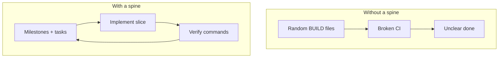
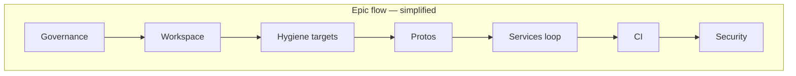
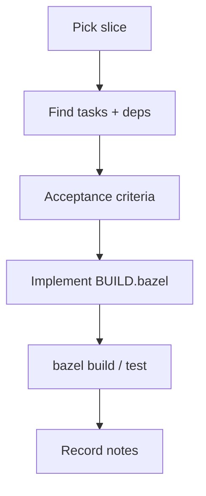
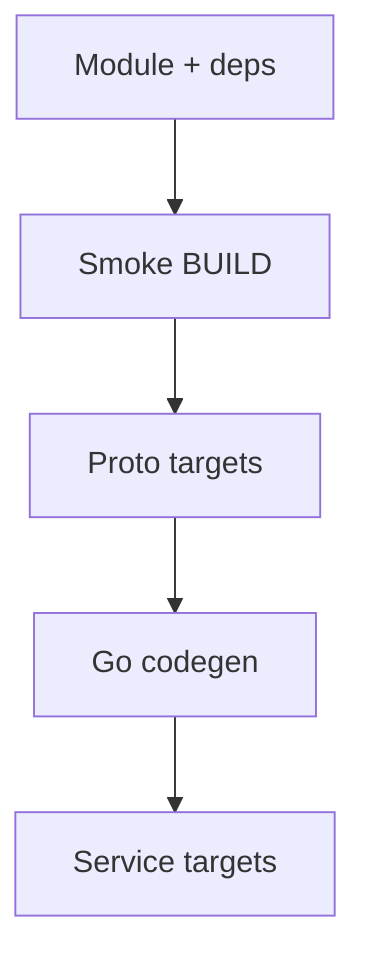
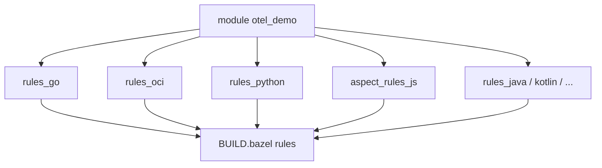
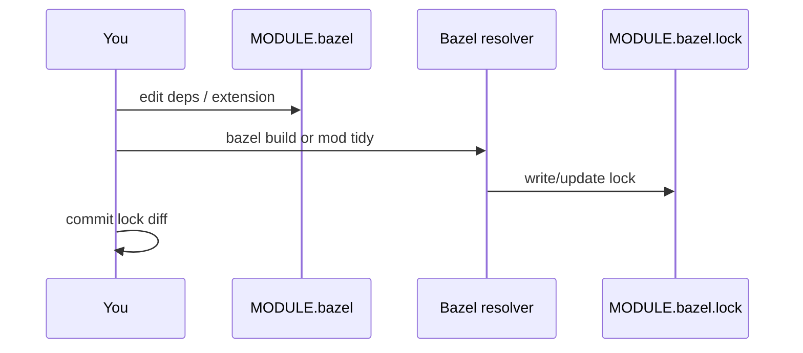
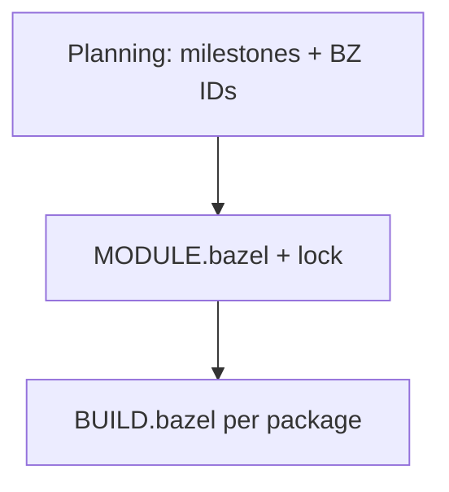

# Planning the migration and laying the workspace foundation (Bzlmod)

[Chapter 02](/docs/Knowledge-base/projects/Bazel-integration/02-what-this-repo-was-before-bazel) showed how the Astronomy Shop ran **before** Bazel: Make, Compose, Dockerfiles, many native toolchains. This chapter answers two big questions in one place:

1. **How did I plan** the move to Bazel without losing my mind?
2. **What is the first “real” Bazel machinery** — `MODULE.bazel`, lockfile, extensions — that everything else stands on?

I write it so you can read **only this knowledge base** and still understand the program. No “go open another document” — I **bring the definitions here**.

<DocImage
  src="/assets/docs/knowledge-base/bazel-integration/03-planning-whiteboard.png"
  alt="Planning the Bazel migration — whiteboard-style overview"
  caption="Planning layers and milestones before touching the build graph."
/>

---

## Part A — Why plan at all?

A polyglot monorepo is not a weekend hack. If you start by randomly adding `BUILD.bazel` files, you get:

- half the services in Bazel and half in Docker-only land, with **no shared story** for protos or images;
- CI that is **slower** than before because you run **both** worlds with no off-ramp;
- reviewers who cannot tell **what “done” means** for a service.

**Planning** here means:

- a **spine** of milestones (M0, M1, …) so each slice has a clear finish line;
- **task IDs** so commits and PRs stay traceable;
- **acceptance criteria** so “I think it works” becomes “this command passes.”



---

## The five planning “layers” I kept in my head

Before touching code, I worked through **five kinds of thinking**. They match the numbered strategy write-ups at the **repo root** (integration blueprint, architecture, concepts, dev environment, task backlog). You do not need those filenames to learn this — here is what each **layer is for**:

<table>
  <thead>
    <tr>
      <th>Layer</th>
      <th>Purpose in plain words</th>
    </tr>
  </thead>
  <tbody>
    <tr>
      <td><strong>1 — Why Bazel</strong></td>
      <td>Value, risks, phased adoption: <em>what problem are we solving?</em></td>
    </tr>
    <tr>
      <td><strong>2 — Target shape</strong></td>
      <td>Where files live: <code>pb/</code>, <code>src/&lt;service&gt;/</code>, <code>tools/bazel/</code>, CI layout.</td>
    </tr>
    <tr>
      <td><strong>3 — Vocabulary</strong></td>
      <td>Workspace, package, target, action, hermeticity — same words as the Bazel docs.</td>
    </tr>
    <tr>
      <td><strong>4 — Machine setup</strong></td>
      <td>Ubuntu (or CI) toolchains: Go, Node, JVM, .NET, … so builds are reproducible.</td>
    </tr>
    <tr>
      <td><strong>5 — Work breakdown</strong></td>
      <td>Ordered tasks with IDs, dependencies, and milestone tags.</td>
    </tr>
  </tbody>
</table>


Think of it as **zoom levels**: motivation → map → dictionary → laptop → checklist.

---

## Program milestones — full definitions (M0 → M6)

These are the **program-level** checkpoints. I treat them as the backbone; individual tasks hang off them.

<table>
  <thead>
    <tr>
      <th>Milestone</th>
      <th>What “done” means (simple)</th>
    </tr>
  </thead>
  <tbody>
    <tr>
      <td><strong>M0</strong></td>
      <td>Bazel <strong>runs</strong> in the repo: you can <code>bazel build</code> at least a smoke target, CI has a <strong>Bazel job</strong> (at first it can be non-blocking), lint/docs can be wrapped as <code>bazel run</code> if you want parity with Make.</td>
    </tr>
    <tr>
      <td><strong>M1</strong></td>
      <td><strong>Protobufs</strong> live in the Bazel graph: <code>proto_library</code> and language outputs (Go, Java, …) are built by Bazel; CI cares about proto <strong>cleanliness</strong> using Bazel (or dual-runs with the old scripts until trust is there).</td>
    </tr>
    <tr>
      <td><strong>M2</strong></td>
      <td><strong>First real wave</strong>: at least one language path is <strong>fully</strong> buildable and testable in Bazel end-to-end (in this project: Go services + confidence the model works).</td>
    </tr>
    <tr>
      <td><strong>M3</strong></td>
      <td><strong>Most application services</strong> build in Bazel; <strong>container images</strong> for migrated services exist as Bazel <code>oci_image</code> (or equivalent) targets — the big expansion across Python, Node, JVM, .NET, Rust, Ruby, Elixir, PHP, proxies, etc.</td>
    </tr>
    <tr>
      <td><strong>M4</strong></td>
      <td><strong>CI is Bazel-first</strong> for the agreed graph: merge requests block on <code>bazel build</code> / <code>bazel test</code> scripts; Docker image matrix may remain for registry multi-arch, but <strong>authority</strong> shifts to Bazel for the migrated set.</td>
    </tr>
    <tr>
      <td><strong>M5</strong></td>
      <td><strong>Release and supply chain</strong>: optional <code>oci_push</code>, SBOM / vulnerability scan hooks, base-image <strong>policy</strong> (allowlists), remote cache docs, developer shortcuts (Make targets), unit-test graph consolidation.</td>
    </tr>
    <tr>
      <td><strong>M6</strong></td>
      <td><strong>Legacy thinning</strong>: Make/Compose stay for runtime, but “how we build” is clearly Bazel; optional extras (remote execution, other CI systems) documented — future work.</td>
    </tr>
  </tbody>
</table>


**Continuity with chapter 02:** M0–M2 happen **while** Compose still owns `make start`. M3–M4 add **parallel** truth in Bazel. M5+ harden **shipping and policy**.

---

## Task IDs (BZ-xxx) — what the numbers mean

Work is grouped by **hundreds** so you can tell what kind of task it is from the ID:

<table>
  <thead>
    <tr>
      <th>Range</th>
      <th>Theme</th>
    </tr>
  </thead>
  <tbody>
    <tr>
      <td><strong>BZ-0xx</strong></td>
      <td>Program setup: charter, service inventory, baselines, risk list</td>
    </tr>
    <tr>
      <td><strong>BZ-1xx</strong></td>
      <td>Workspace bootstrap: Bazel version, <code>MODULE.bazel</code>, smoke target, <code>.bazelrc</code>, <code>.bazelignore</code>, <code>tools/bazel/</code> layout</td>
    </tr>
    <tr>
      <td><strong>BZ-2xx</strong></td>
      <td>Proto / codegen</td>
    </tr>
    <tr>
      <td><strong>BZ-3xx</strong></td>
      <td>Per-language or per-service migration</td>
    </tr>
    <tr>
      <td><strong>BZ-4xx</strong></td>
      <td>OCI images and artifacts</td>
    </tr>
    <tr>
      <td><strong>BZ-5xx</strong></td>
      <td>Tests (unit, e2e, trace)</td>
    </tr>
    <tr>
      <td><strong>BZ-6xx</strong></td>
      <td>CI/CD scripts and workflows</td>
    </tr>
    <tr>
      <td><strong>BZ-7xx</strong></td>
      <td>Security and policy (SBOM, scan, allowlists)</td>
    </tr>
    <tr>
      <td><strong>BZ-8xx</strong></td>
      <td>Docs, developer UX, quickstarts, Make wrappers</td>
    </tr>
    <tr>
      <td><strong>BZ-9xx</strong></td>
      <td>Hardening, optional RBE, cleanup</td>
    </tr>
  </tbody>
</table>

**How I use IDs in real life:**

- Put **`BZ-123`** in a commit message or PR title when it closes that slice.
- When someone asks “why does this exist?” six months later, **search the ID** in the repo.

---

## Epics — batches of work (conceptual map)

Tasks are grouped into **epics** (big chapters). You do not need to memorize every epic name; you need the **idea**:

- **Program / governance** — charter, tracker table for each service, “how fast is CI?” baselines, risk register.
- **Workspace bootstrap** — Bazel can load, trivial build works, configs exist.
- **Hygiene in Bazel** — markdownlint, yamllint, license, sanity: often **wrapping** existing Make behavior first.
- **Protobuf epic** — one source of truth under `pb/`, generated code consumed by services.
- **Per-service migration** — repeated pattern: library → binary → test → image.
- **CI epic** — scripts that run the **same** graph locally and on GitHub; cache; later “affected targets” hints.
- **Security epic** — pinned bases, allowlists, SBOM, scans on release paths.



---

## How I planned one slice of work (repeatable recipe)

This is the loop I actually ran; it stays the same whether the milestone is “smoke target” or “PHP service + image”.

1. **Pick a milestone slice** — e.g. “M3 — quote service builds and has an image.”
2. **Find tasks** that belong to that slice (by theme: proto consumer? OCI? tests?).
3. **Read acceptance criteria** — what command must pass? what files must exist?
4. **Check dependencies** — do I need protos or another library target first?
5. **Implement** `BUILD.bazel` (+ small `tools/bazel/*.bzl` helpers if the rule set is ugly).
6. **Verify** locally with the same commands CI will use.
7. **Write down** what changed: service row status, commands, odd env vars — so future me does not rely on memory.



**Acceptance criteria** sounds corporate; it is really just **“the proof”**: e.g. `bazel build //src/quote:quote_image` exits 0.

<Terminal
  title="Example acceptance check"
  commands={[
    {
      command: 'bazel build //src/quote:quote_image',
      output: '# exits 0 when the slice is done',
    },
  ]}
/>

---

## Dependencies between tasks (DAG thinking before Bazel DAG)

Tasks say **depends on** other tasks. Example pattern: you cannot claim a Go service is “done in Bazel” if **`MODULE.bazel` does not declare `rules_go`** and `//pb:...` does not build.



This is the same **dependency graph** habit Bazel will enforce in code — planning just practices it early.

---

## Part B: Bzlmod and the workspace loading layer

Older Bazel projects used a giant **`WORKSPACE`** file. This fork is **Bzlmod-first**: the module is declared in **`MODULE.bazel`**, and versions resolve into **`MODULE.bazel.lock`**.

### Why it matters

- **Reproducible** dependency resolution: everyone gets the **same** rule versions when the lockfile is committed.
- **Cleaner** upgrades: bump a module version, run Bazel, commit lock diff — reviewable like any lockfile.
- **Extensions**: some tools (pip, OCI pulls) need **configuration**, not just a version number — Bzlmod extensions handle that.

### `module()` — naming the workspace

At the top level you give the project a **module name** and version (semantic for your org; demos often use `0.0.0`):

```python
module(
    name = "otel_demo",
    version = "0.0.0",
)
```

This is **not** the Docker image name and **not** the Go module path — it is the **Bazel module** identity.

### `bazel_dep()` — pulling rule sets from the registry

Each line declares a dependency on another **published module** (typically from the **Bazel Central Registry**, BCR):

```python
bazel_dep(name = "rules_go", version = "0.59.0")
bazel_dep(name = "rules_oci", version = "2.3.0")
# ... many more: rules_python, aspect_rules_js, rules_java, etc.
```

**Plain words:** you are saying “this workspace uses these rule packages at these versions.” Starlark rules like `go_binary` come from those modules.



### Module extensions — when a version is not enough

Some modules expose an **extension** object: you call functions on it, then **`use_repo`** to create repositories your code can reference.

**Example A — OCI base images (`rules_oci`)**

You pin **container bases by digest** (good for supply chain). Pattern:

```python
oci = use_extension("@rules_oci//oci:extensions.bzl", "oci")

oci.pull(
    name = "distroless_static_debian12_nonroot",
    digest = "sha256:a9329520abc449e3b14d5bc3a6ffae065bdde0f02667fa10880c49b35c109fd1",
    image = "gcr.io/distroless/static-debian12",
    platforms = [
        "linux/amd64",
        "linux/arm64",
    ],
)
```

Then **`use_repo(oci, "distroless_static_debian12_nonroot", ...)`** (plus platform-specific repo names) exposes labels like:

`@distroless_static_debian12_nonroot_linux_amd64//:...`

that `oci_image` rules use as **`base`**.

```mermaid
flowchart LR
  MB[MODULE.bazel]
  MB --> EXT[oci extension]
  EXT --> PULL[oci.pull name + digest]
  PULL --> REPO[@repo // targets]
  REPO --> OIMG[oci_image base = ...]
```

**Example B — Python pip hubs**

Python deps are often declared via **`pip.parse`** (or similar) in the same file: requirements → hub repository → `py_library` / `py_binary` deps. Same **extension** idea: configure once, consume in many `BUILD.bazel` files.

<DocImage
  src="/assets/docs/knowledge-base/bazel-integration/03-module-bazel-extensions.png"
  alt="MODULE.bazel, extensions, and lockfile relationships"
  caption="Bzlmod: module, extensions, and resolved repositories."
/>

### `MODULE.bazel.lock`

Bazel writes a **lockfile** capturing the resolved graph. **Commit it.** Treat it like:

- **npm:** `package-lock.json`
- **Go:** `go.sum`
- **Rust:** `Cargo.lock`

When you bump a `bazel_dep` or change an extension block, the lockfile diff tells reviewers **exactly** what changed in the external graph.



### Commands when modules act up

<Terminal
  title="Bazel module diagnostics"
  commands={[
    {
      command: 'bazelisk mod graph',
      output: '# Show resolved module graph (verbose but useful)',
    },
    {
      command: 'bazelisk mod tidy',
      output: '# Fix common extension / use_repo ordering issues',
    },
  ]}
/>

If Bazel says **“run bazel mod tidy”**, I run it — arguing rarely wins.

### `.bazelrc` and profiles

**`.bazelrc`** holds default flags. This repo uses **configs** such as:

- **`--config=ci`** — nicer logs for CI
- **`--config=unit`** — test tag filters (covered more in later chapters)

Optional **local-only** settings go in **`.bazelrc.user`** (gitignored), loaded via:

```text
try-import %workspace%/.bazelrc.user
```

So I can try **remote cache** URLs or experiments without committing secrets.

### Pitfall: duplicate toolchain registration

Copy-pasting tutorials sometimes registers the same **toolchain** twice. The error is ugly; the fix is usually **delete the duplicate** `register_toolchains` or redundant extension stanza and **`mod tidy`**.

### `WORKSPACE` vs Bzlmod — one sentence

**WORKSPACE** = legacy “list everything in one file.” **Bzlmod** = modules + lockfile + extensions — the direction Bazel is pushing for new work.

---

## How Part A and Part B fit together

<table>
  <thead>
    <tr>
      <th>Planning piece</th>
      <th>Bzlmod piece</th>
    </tr>
  </thead>
  <tbody>
    <tr>
      <td>M0 “workspace bootstrap” tasks</td>
      <td><code>MODULE.bazel</code>, <code>.bazelversion</code>, smoke <code>BUILD.bazel</code></td>
    </tr>
    <tr>
      <td>M1 proto tasks</td>
      <td><code>bazel_dep</code> on protobuf rules + <code>pb/</code> targets</td>
    </tr>
    <tr>
      <td>M3 OCI tasks</td>
      <td><code>rules_oci</code> + <strong><code>oci.pull</code></strong> extensions + <code>oci_image</code> in services</td>
    </tr>
    <tr>
      <td>M4 CI tasks</td>
      <td><code>bazelisk</code> + <code>--config=ci</code> + same graph as local</td>
    </tr>
  </tbody>
</table>



---

## What comes next in this series

**Chapter 04** zooms in on **four core Bazel ideas** (graph, hermeticity, analysis vs execution, test tags) — the vocabulary you use every day.

**Chapter 06** onward walks milestones in order: first smoke and lint, then protos, then languages — always on top of the foundation you just read.

---

<Callout type="note" title="Note">
All <strong>Bzlmod</strong> detail is in <strong>Part B</strong> above. There is no separate “chapter 05” file — it was removed so this chapter stays the single source for module + lock + extensions.
</Callout>
