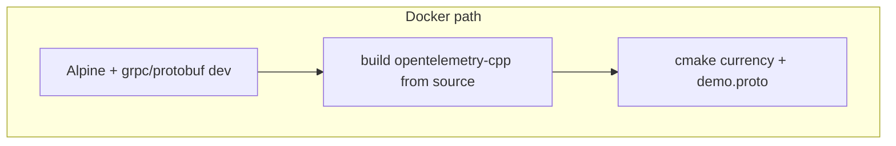
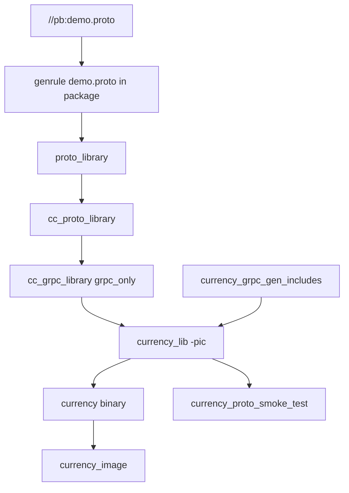

# C++ `currency`: gRPC codegen, `rules_cc`, a proto smoke test, and distroless **cc**

**`currency`** (**BZ-092**) is where I proved **C++ + gRPC + OpenTelemetry C++** could live in the **same Bazel graph** as **Go, Java, and Rust** — without pretending **CMake-in-Docker** was the only honest build. It is also where I learned **version alignment** the hard way: **protobuf**, **gRPC C++**, and **Abseil** must agree, or **`cc_grpc_library`** and **`grpc++`** explode with errors that look like **missing `upb`** targets.

This chapter is **before / after**, **`MODULE.bazel` overrides**, the **`genrule` copy** of **`demo.proto`**, the **custom include rule**, **`-pic`**, **`currency_proto_smoke_test`**, and **OCI** on the **same distroless cc** family as **Rust shipping**.

---

## Before Bazel — how `currency` built

**Dockerfile (Alpine multi-stage):**

- **Base:** **Alpine** with **`grpc-dev`** and **`protobuf-dev`**.  
- **Builder:** **git**, **cmake**, **g++**, clone **opentelemetry-cpp** at a **version tag**, **cmake** with **OTLP gRPC**, **Abseil**, **install** to **`/usr/local`**.  
- **App:** copy **`src/currency`** CMake tree + **`pb/demo.proto` → `proto/demo.proto`**, **`cmake` + `make install`**.  
- **Release:** copy **`/usr/local`**, **`ENTRYPOINT`** runs **`currency`** with port from env.

**What that optimizes for:** a **self-contained** image that compiles **OTel C++** inside Docker. **What it does not give:** **incremental** C++ builds tied to a **monorepo DAG** or **shared** protobuf versions with **Java gRPC** unless I **manually** keep them aligned.



---

## After Bazel — the paradigm I use

1. **Root module** pins **protobuf 29.3**, **gRPC C++ 1.66.0.bcr.2**, **abseil-cpp 20240116.1** so **BCR** does not silently pull **protobuf 33+ / grpc 1.69+**, which **broke** **`grpc++_base`** against **`upb`** in experiments I do not want to repeat.  
2. **`bazel_dep`** on **`grpc`** (repo name **`com_github_grpc_grpc`**) so **`cc_grpc_library.bzl`** is loadable; **`opentelemetry-cpp`** and **googletest** from BCR.  
3. **`//src/currency`:** **`genrule`** copies **`//pb:demo.proto`** into the package as **`demo.proto`** so **`proto_library`** / **`cc_proto_library`** / **`cc_grpc_library`** see a **same-package** `.proto` source (the layout **`rules_cc` + protobuf** expect for this wiring).  
4. **`currency_grpc_gen_includes`** adds **`-I`** paths for generated **`demo.*`** headers and **gRPC health** stubs under the **BCR grpc** external tree (**`grpc~`** under **`bazel-bin/external`**).  
5. **`cc_library` `currency_lib`** links **gRPC + OTel C++** targets; **`features = ["-pic"]`** avoids **`.so`** stub linkage pain I hit with **gRPC C core** symbols.  
6. **`cc_binary` `currency`** is thin — only **`deps = [":currency_lib"]`** so **generated include dirs** propagate correctly from the library.  
7. **`cc_test` `currency_proto_smoke_test`** links **protobuf + gtest** only — **not** a full gRPC server test yet.  
8. **OCI:** same **`mtree` + tar + `oci_image`** pattern as **shipping**, **distroless cc-debian13**, **`entrypoint ./currency`**, **`cmd`** default port **7001**.



---

## `MODULE.bazel` — why the overrides exist (inlined)

**Symptom I saw without these:** **`opentelemetry-cpp`** / **gRPC** edges pulled **newer** **protobuf** / **grpc**, and **`@@grpc~//:grpc++_base`** expected **`@@protobuf~//upb:mem`**-style targets that **did not exist** in the **older** protobuf graph — **opaque C++ rule failures**.

**Fix:** **`single_version_override`** on **protobuf**, **grpc**, and **abseil-cpp**, then explicit **`bazel_dep`** versions that match.

```11:26:MODULE.bazel
# BZ-092: Without this, `opentelemetry-cpp` / `grpc` edges pull protobuf 33+ and grpc 1.69+, which
# breaks `@@grpc~//:grpc++_base` (expects `@@protobuf~//upb:mem` targets present in older protobuf).
single_version_override(
    module_name = "protobuf",
    version = "29.3",
)

single_version_override(
    module_name = "grpc",
    version = "1.66.0.bcr.2",
)

single_version_override(
    module_name = "abseil-cpp",
    version = "20240116.1",
)
```

**C++ stack declaration:**

```130:134:MODULE.bazel
# M3 BZ-092: C++ currency — gRPC C++ codegen (BCR grpc) + opentelemetry-cpp 1.24 (OTLP gRPC exporters, SDK).
# Direct `grpc` dep so `@com_github_grpc_grpc//bazel:cc_grpc_library.bzl` is loadable from `//pb`.
bazel_dep(name = "grpc", version = "1.66.0.bcr.2", repo_name = "com_github_grpc_grpc")
bazel_dep(name = "opentelemetry-cpp", version = "1.24.0.bcr.1")
bazel_dep(name = "googletest", version = "1.14.0.bcr.1", repo_name = "com_google_googletest")
```

**`.bazelrc`** still forces **C++17** for **host** tools (Java gRPC codegen touches **Abseil C++**); that line helps **this** graph too:

```7:9:.bazelrc
# Java gRPC codegen pulls Abseil C++ (host tools); default GCC often defaults to pre-C++17.
common --host_cxxopt=-std=c++17
common --cxxopt=-std=c++17
```

---

## `genrule` + `proto_library` + `cc_grpc_library`

**Comment in-tree (why I copy the file):**

```16:24:src/currency/BUILD.bazel
# Codegen in this package (`proto_library` must see `.proto` in-package — copy canonical `pb/demo.proto`).
genrule(
    name = "currency_demo_proto_copy",
    srcs = ["//pb:demo.proto"],
    outs = ["demo.proto"],
    cmd = "cp $(location //pb:demo.proto) $@",
)

proto_library(
    name = "currency_demo_proto",
    srcs = [":currency_demo_proto_copy"],
)
```

Then **`cc_grpc_library`** with **`grpc_only = True`** on top of **`cc_proto_library`**:

```33:43:src/currency/BUILD.bazel
cc_proto_library(
    name = "currency_demo_cc_proto",
    deps = [":currency_demo_proto"],
)

cc_grpc_library(
    name = "currency_demo_cc_grpc",
    srcs = [":currency_demo_proto"],
    grpc_only = True,
    deps = [":currency_demo_cc_proto"],
)
```

**Note:** **`//pb`** also defines **`demo_cc_proto`**, **`demo_cc_grpc`**, and **`demo_cpp_grpc`** for **reuse** elsewhere. **`currency`** still uses the **in-package** copy pattern so **codegen output paths** and **health proto** includes stay **local** and **predictable** for this service’s **CMake-shaped** mental model.

---

## `currency_grpc_gen_includes` — generated headers and **health** protos

Generated **`#include <demo.pb.h>`** / **`demo.grpc.pb.h`** land under **`bazel-bin/src/currency`**. **gRPC health** reflection uses **`#include <grpc/health/v1/health.grpc.pb.h>`** from the **BCR grpc** tree. The thin **Starlark rule** exposes both as **`CcInfo` `includes`**:

```9:18:src/currency/currency_includes.bzl
def _currency_grpc_gen_includes_impl(ctx):
    bin_root = ctx.bin_dir.path
    demo_inc = paths.join(bin_root, "src", "currency")
    health_inc = paths.join(bin_root, "external", "grpc~", "src", "proto")
    return [
        CcInfo(
            compilation_context = cc_common.create_compilation_context(
                includes = depset(direct = [demo_inc, health_inc]),
            ),
        ),
    ]
```

**`health_proto`** dependency is **`@com_github_grpc_grpc//src/proto/grpc/health/v1:health_proto`** on **`currency_lib`** — **not** the same **`@grpc-proto`** path the **Java** rules use, because **`cc_grpc_library`** here **codegens** from paths that **line up** with this **grpc** external layout.

---

## `currency_lib`, **`-pic`**, and the thin **`cc_binary`**

```58:77:src/currency/BUILD.bazel
cc_library(
    name = "currency_lib",
    features = ["-pic"],
    srcs = glob(
        ["src/**/*.cpp"],
        exclude = ["src/currency_proto_smoke_test.cpp"],
    ) + glob(["src/**/*.h"]),
    includes = ["src"],
    deps = [
        ":currency_grpc_gen_includes",
        ":currency_demo_cc_proto",
        ":currency_demo_cc_grpc",
        "@com_github_grpc_grpc//src/proto/grpc/health/v1:health_proto",
    ] + _CURRENCY_OTEL_DEPS,
)

cc_binary(
    name = "currency",
    deps = [":currency_lib"],
)
```

**`features = ["-pic"]`:** without it, I saw **shared-object** **gRPC stub** artifacts link in ways that **failed** with **undefined symbols** from the **gRPC C core** at link time. Forcing **non-PIC** **`.a`-style** linkage for that stub code was the **pragmatic** fix documented in the **M3** narrative.

**Library vs binary split:** **`cc_proto_library`** / **`cc_grpc_library`** **propagate** **compile** contexts through **`cc_library`**. Putting **all** `.cpp` in **`currency_lib`** and **only** linking it from **`cc_binary`** keeps **that propagation** honest.

---

## `currency_proto_smoke_test` — what it proves (and what it does not)

```79:89:src/currency/BUILD.bazel
cc_test(
    name = "currency_proto_smoke_test",
    size = "small",
    srcs = ["src/currency_proto_smoke_test.cpp"],
    tags = ["unit"],
    deps = [
        ":currency_grpc_gen_includes",
        ":currency_demo_cc_proto",
        "@com_google_googletest//:gtest_main",
    ],
)
```

**Source (minimal):**

```4:14:src/currency/src/currency_proto_smoke_test.cpp
#include <demo.pb.h>
#include <gtest/gtest.h>

namespace
{
TEST(CurrencyProtoSmoke, DemoEmptyDefaultConstructed)
{
  oteldemo::Empty empty;
  (void)empty;
  EXPECT_TRUE(true);
}
} // namespace
```

**What it proves:** **protobuf C++** codegen for **`demo.proto`** is **wired** — **`oteldemo::Empty`** compiles and links. **What it does not prove:** **gRPC server** behavior, **OTel export**, or **network**. A **full `cc_test`** against **live** gRPC would be **heavier** (tags, hermeticity, flakiness). I took the **smoke** step first so CI can say **“proto graph is not imaginary.”**

---

## OCI — same **cc** base as **Rust shipping**

```111:119:src/currency/BUILD.bazel
oci_image(
    name = "currency_image",
    base = "@distroless_cc_debian13_nonroot_linux_amd64//:distroless_cc_debian13_nonroot_linux_amd64",
    cmd = ["7001"],
    entrypoint = ["./currency"],
    exposed_ports = ["7001/tcp"],
    tars = [":currency_layer"],
    workdir = "/app",
)
```

**`glibc`-linked** C++ binary → **distroless cc**, not **static**. **Docker** path used **Alpine** + **musl**; **Bazel** path aligns with **debian13 cc** **distroless** for **GNU** linkage — same **class** of decision as **`shipping`**.

---

## Commands I use

<Terminal
  title="Shell"
  commands={[
    {
      command: "bazelisk build //src/currency:currency --config=ci",
      output: "",
    },
    {
      command: "bazelisk test  //src/currency:currency_proto_smoke_test --config=ci --config=unit",
      output: "",
    },
    {
      command: "bazelisk build //src/currency:currency_image --config=ci",
      output: "",
    },
    {
      command: "bazelisk run  //src/currency:currency_load",
      output: "",
    },
    {
      command: "docker image ls | grep demo-currency",
      output: "",
    },
  ]}
/>

---

## Docker vs Bazel — what I still say out loud

<table>
  <thead>
    <tr>
      <th>Topic</th>
      <th>Reality</th>
    </tr>
  </thead>
  <tbody>
    <tr>
      <td><strong>OTel C++</strong></td>
      <td><strong>Dockerfile</strong> <strong>builds opentelemetry-cpp from source</strong> inside the image. <strong>Bazel</strong> uses <strong>BCR <code>opentelemetry-cpp</code></strong> targets as <strong>deps</strong> — different <strong>shape</strong>, same <strong>intent</strong>.</td>
    </tr>
    <tr>
      <td><strong>libc</strong></td>
      <td><strong>Docker</strong> = <strong>Alpine / musl</strong>; <strong>Bazel OCI</strong> = <strong>distroless cc / glibc</strong> — <strong>linker</strong> choice must match the <strong>binary</strong>.</td>
    </tr>
    <tr>
      <td><strong>Tests</strong></td>
      <td><strong><code>currency_proto_smoke_test</code></strong> = <strong>proto</strong> smoke only; <strong>no</strong> <strong><code>cc_test</code></strong> for full <strong>gRPC</strong> yet.</td>
    </tr>
  </tbody>
</table>

---

## When things break — my checklist

<table>
  <thead>
    <tr>
      <th>Symptom</th>
      <th>What I check</th>
    </tr>
  </thead>
  <tbody>
    <tr>
      <td><strong><code>upb</code></strong> / protobuf mismatch</td>
      <td><strong>Root <code>single_version_override</code></strong> still <strong>29.3</strong> / <strong>grpc 1.66.bcr.2</strong> / <strong>abseil</strong> pin.</td>
    </tr>
    <tr>
      <td><strong><code>demo.pb.h</code></strong> not found</td>
      <td><strong><code>currency_grpc_gen_includes</code></strong> on <strong><code>deps</code></strong>; <strong><code>bazel-bin/src/currency</code></strong> path after <strong>codegen</strong>.</td>
    </tr>
    <tr>
      <td><strong>Health proto include errors</strong></td>
      <td><strong><code>grpc~</code></strong> path in <strong><code>currency_includes.bzl</code></strong> vs actual <strong>external</strong> name; <strong><code>health_proto</code></strong> label.</td>
    </tr>
    <tr>
      <td><strong>Link errors in <code>currency</code> only</strong></td>
      <td><strong><code>-pic</code></strong> on <strong><code>currency_lib</code></strong>; <strong>gRPC</strong> <strong><code>.so</code></strong> vs <strong><code>.a</code></strong> behavior.</td>
    </tr>
  </tbody>
</table>

---

## Interview line

> “**C++ in a polyglot Bazel repo is a version-pinning game first** and a **`cc_binary` second.** I use a **small proto smoke test** so **codegen** cannot drift silently while I defer **full gRPC `cc_test`**.”
