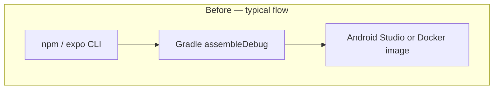
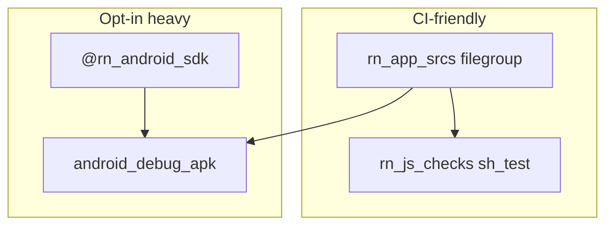

# React Native / Android (Expo): JS gates, a hermetic SDK bundle, and an opt-in debug APK

Mobile is a **different galaxy** than **`go_binary`**: **Expo**, **Metro**, **Gradle**, **NDK**, **signing**, **emulators**, **Pods**. **BZ-096** was my **bounded** proof for this fork — **Android only**, **no iOS in Bazel**, **no `rules_js` hub** for this app (the lockfile stays **`npm`**). I split the work into two lanes:

1. **`rn_js_checks`** — **`sh_test`** that **`npm ci`**, runs **`tsc --noEmit`** and **`jest`**, tagged **`unit`** so CI can gate **TypeScript + tooling** **without** downloading the **Android SDK**.  
2. **`android_debug_apk`** — custom rule **`rn_android_debug_apk`** that copies the app tree, **`npm ci`**, runs **`./gradlew :app:assembleDebug`** with **`JAVA_HOME`** / **`ANDROID_SDK_ROOT`** pointing at **`@rn_android_sdk`** — **Temurin 17** + **cmdline-tools** + **`sdkmanager`** packages (**API 34**, **NDK 26.x**), **linux-amd64 only**, **lazy** until you **build** that target.

I **did not** ship **`oci_image`** for the phone — the artifact is **`app-debug.apk`**. That keeps expectations honest.

---

## Before Bazel — how the demo app lived

<table>
  <thead>
    <tr>
      <th>Field</th>
      <th>Detail</th>
    </tr>
  </thead>
  <tbody>
    <tr>
      <td><strong>Stack</strong></td>
      <td><strong>Expo 51</strong> / <strong>Expo Router</strong>, <strong>React Native 0.74</strong>, <strong>TypeScript</strong>; <strong>Android</strong> via <strong>Gradle</strong> wrapper + <strong>React Native Gradle plugin</strong> (Node for <strong>Metro</strong> / <strong>expo export:embed</strong>).</td>
    </tr>
    <tr>
      <td><strong>Build / run</strong></td>
      <td><strong><code>npm run android</code></strong>, <strong><code>expo run:android</code></strong>; <strong>Docker</strong> <strong><code>android.Dockerfile</code></strong> (<strong><code>reactnativecommunity/react-native-android</code></strong>).</td>
    </tr>
    <tr>
      <td><strong>iOS</strong></td>
      <td><strong>CocoaPods</strong> + <strong>Xcode</strong> — <strong>out of scope</strong> for Bazel in this fork.</td>
    </tr>
    <tr>
      <td><strong>Protos</strong></td>
      <td>Generated <strong><code>protos/demo.ts</code></strong>; <strong><code>@grpc/grpc-js</code></strong> is a <strong>devDependency</strong> so <strong><code>tsc</code></strong> passes in CI without dragging gRPC into the RN runtime bundle.</td>
    </tr>
  </tbody>
</table>

**Mental model:** developers lived in **npm + Expo CLI + Android Studio / Docker**. CI did **not** have one obvious “`bazel test //mobile`” until **BZ-096**.



---

## After Bazel — goals I actually implemented

1. **Test in CI without an emulator** — **`rn_js_checks`** only needs **Node** + **npm** + network for **`npm ci`**.  
2. **Optional APK on Linux x86_64** — **`@rn_android_sdk`** bundles **JDK + SDK** so I am **not** forced to align **SDKMAN Java** or **`ANDROID_HOME`** with the demo; **Gradle** inside the action still uses **host `node` / `npm`** (**`rn_gradle_apk.bzl`** and **`run_rn_js_checks.sh`** expect **Node 20+**; **`.github/workflows/checks.yml`** sets **Node 22** for **`bazel_ci`**).

**What “hermetic” means here:** **pinned URLs + SHA-256** for **JDK** and **cmdline-tools**, **`sdkmanager`** installs a **fixed package list** into an **external repository**. It does **not** mean “no host Node” or “Gradle never touches disk outside Bazel’s manifest” — see **`no-sandbox`** below.



---

## `MODULE.bazel` — wiring **`@rn_android_sdk`**

```213:215:MODULE.bazel
# BZ-096: React Native Android — hermetic @rn_android_sdk (Temurin 17 + API 34 + NDK 26.x via sdkmanager; linux-amd64).
rn_android = use_extension("//tools/bazel/rn_android:extension.bzl", "rn_android_sdk")
use_repo(rn_android, "rn_android_sdk")
```

**Extension** — one line that registers the **repository rule**:

```6:12:tools/bazel/rn_android/extension.bzl
def _rn_android_sdk_mod_impl(_mctx):
    rn_android_sdk_repository(name = "rn_android_sdk")

rn_android_sdk = module_extension(
    implementation = _rn_android_sdk_mod_impl,
    doc = "Hermetic @rn_android_sdk (JDK + Android SDK) for //src/react-native-app Android Gradle builds.",
)
```

**`sdk_repo.bzl`** (behavior in prose + key constants):

- **OS:** **Linux x86_64 only** — **`fail()`** on **macOS** or **non-amd64** with a hint to **Docker** (`android.Dockerfile`) or **local Android Studio**.  
- **JDK:** pinned **Temurin 17.0.13+11** tarball (**URL + SHA-256** in the file).  
- **Android:** pinned **commandlinetools** zip, laid out as **`sdk/cmdline-tools/latest`**, then **`yes | sdkmanager --licenses`** and install **`platform-tools`**, **`platforms;android-34`**, **`build-tools;34.0.0`**, **`ndk;26.1.10909125`** — aligned with **`android/build.gradle`**.  
- **Lazy:** the **big** download runs when something **depends** on **`@rn_android_sdk//:root`** (**`android_debug_apk`** today). **`rn_js_checks`** does **not** depend on it.

```62:72:tools/bazel/rn_android/sdk_repo.bzl
    # Match src/react-native-app/android/build.gradle (compileSdk 34, build-tools 34.0.0, NDK 26.1.10909125).
    pkgs = ["platform-tools", "platforms;android-34", "build-tools;34.0.0", "ndk;26.1.10909125"]
    quoted = " ".join(['"%s"' % p for p in pkgs])
    rctx.report_progress("sdkmanager install (large download; first run can take 10–20+ minutes)")
    ins = rctx.execute(
        ["/bin/bash", "-c", "\"%s\" --sdk_root=\"%s\" %s" % (sm, sdk_root, quoted)],
        environment = env,
        timeout = 3600,
    )
```

---

## `src/react-native-app/BUILD.bazel` — sources, APK rule, JS test

```10:48:src/react-native-app/BUILD.bazel
# iOS is intentionally excluded from globs. Do not ship node_modules or Gradle outputs.
_RN_APP_FILES = glob(
    ["**"],
    exclude = [
        "node_modules/**",
        "ios/**",
        "android/**/build/**",
        "android/.gradle/**",
        ".expo/**",
        "dist/**",
        "web-build/**",
    ],
)

filegroup(
    name = "rn_app_srcs",
    srcs = _RN_APP_FILES,
)

rn_android_debug_apk(
    name = "android_debug_apk",
    srcs = [":rn_app_srcs"],
    tags = [
        "manual",
        "no-sandbox",
        "requires-network",
    ],
)

sh_test(
    name = "rn_js_checks",
    srcs = ["run_rn_js_checks.sh"],
    data = [":rn_app_srcs"],
    size = "enormous",
    tags = [
        "requires-network",
        "unit",
    ],
)
```

**Why no `aspect_rules_js` hub here:** **payment** / **frontend** use **pnpm** + **`npm_translate_lock`**. This app keeps **`package-lock.json`** and **npm** semantics; duplicating a second **JS** graph was **scope** I deferred.

---

## `rn_gradle_apk.bzl` — how **`app-debug.apk`** is produced

**Environment inside the action:**

- **`JAVA_HOME`** / **`ANDROID_SDK_ROOT`** / **`ANDROID_HOME`** derived from **`dirname(@rn_android_sdk//:root)`** — **not** SDKMAN.  
- **`GRADLE_USER_HOME`** and **`NPM_CONFIG_CACHE`** are **fresh temp dirs** — **cold** but **isolated** from **`~/.gradle`**.

**Steps:** manifest copy → **`npm ci`** → **`chmod +x android/gradlew`** → **`./gradlew :app:assembleDebug`** → copy **`app/build/outputs/apk/debug/app-debug.apk`** to the **declared output**.

```35:65:tools/bazel/rn_android/rn_gradle_apk.bzl
        command = """
set -euo pipefail
SDK_BUNDLE="$(dirname "{marker}")"
export JAVA_HOME="$SDK_BUNDLE/jdk"
export ANDROID_SDK_ROOT="$SDK_BUNDLE/sdk"
export ANDROID_HOME="$ANDROID_SDK_ROOT"
export GRADLE_USER_HOME="$(mktemp -d)"
export NPM_CONFIG_CACHE="$(mktemp -d)"
trap 'rm -rf "$GRADLE_USER_HOME" "$NPM_CONFIG_CACHE" "$ROOT"' EXIT
ROOT="$(mktemp -d)"
mkdir -p "$ROOT"
while IFS=$(printf '\\t') read -r src dst || [ -n "$src" ]; do
  [ -z "$src" ] && continue
  d="$ROOT/$(dirname "$dst")"
  mkdir -p "$d"
  cp "$src" "$ROOT/$dst"
done < {manifest}
cd "$ROOT"
# ... node/npm checks ...
npm ci --no-audit --no-fund
chmod +x android/gradlew
cd android
./gradlew --no-daemon :app:assembleDebug
cp app/build/outputs/apk/debug/app-debug.apk "{out_apk}"
```

**Why `no-sandbox`:** Gradle walks **many** paths under **SDK/NDK**; listing every file as a Bazel input is **impractical**. **`no-sandbox`** lets Gradle read the **fetched** tree while **app sources** stay **declared** via the **filegroup** + manifest.

**Why `manual`:** first **SDK** fetch is **slow** and **large**. **Default CI** does **not** **`bazel build`** **`android_debug_apk`**. **`rn_js_checks`** is still exercised because **`tools/bazel/ci/ci_full.sh`** runs **`bazel test //... --config=ci --config=unit --build_tests_only`**, and that target is tagged **`unit`** (**M4** **`bazel_ci`** job in **`.github/workflows/checks.yml`**). **`android_debug_apk`** stays **opt-in** locally or in a **dedicated** workflow job.

---

## `run_rn_js_checks.sh` — the body of the **`unit`** gate for this app

CI does not call this script by name; it runs **`bazel test //src/react-native-app:rn_js_checks`** as part of the **repo-wide** **`--config=unit`** sweep (**`ci_full.sh`**).

```35:39:src/react-native-app/run_rn_js_checks.sh
npm ci --no-audit --no-fund
# Typecheck (strict TS; Expo base config).
npm exec -- tsc --noEmit
# Jest (jest-expo); no in-tree tests yet — still validates preset + resolution.
npm exec -- jest --ci --watchAll=false --passWithNoTests
```

---

## SDKMAN vs **`@rn_android_sdk`** (explicit separation)

Many developers install **Java** via **SDKMAN** for other JVM work. **That does not substitute** for **`@rn_android_sdk`** on **`android_debug_apk`**: the rule **overrides** **`JAVA_HOME`** from the **external repo**. **SDKMAN** neither **replaces** nor **conflicts** unless you **expect** the APK action to use your **login-shell** JDK — it **won’t**.

---

## Commands I use

<Terminal
  title="Shell"
  commands={[
    {
      command: "bazelisk test //src/react-native-app:rn_js_checks --config=ci --config=unit",
      output: "# What CI runs (fast relative to full SDK)",
    },
    {
      command: "bazelisk build //src/react-native-app:android_debug_apk --config=ci",
      output: "# Opt-in \u2014 linux-amd64, long first run (sdkmanager + Gradle)\n# Output: bazel-bin/src/react-native-app/app-debug.apk (path may vary by config; use bazel cquery / build output)",
    },
  ]}
/>

---

## Future directions I would pitch (not implemented here)

These are **logical next steps** if this demo ever **ships** mobile to testers from Bazel:

1. **Firebase App Distribution (or Play internal testing)** — CI job that **depends** on **`//src/react-native-app:android_debug_apk`** (or a **`release`** variant once **signing** exists), then runs **`firebase appdistribution:distribute`** or **Gradle Play Publisher** with **encrypted** service account / **GitHub OIDC**. Bazel stays the **artifact factory**; Firebase/Google **own delivery**.  
2. **`rules_android` / `mobile-install`** — gradually replace **shell + Gradle** with **Starlark-first** Android rules where the team can afford the **migration tax**; keep **`@rn_android_sdk`** or swap for **remote** **RBE** toolchains.  
3. **Separate `bazel build` CI job** — **`android_debug_apk`** on a **larger** runner with **disk** and **cache** for **`~/.android`** / Gradle **remote** cache **only** if you **opt back in** to shared **`GRADLE_USER_HOME`** (trade **isolation** for **speed**).  
4. **iOS** — **out of scope** here; a real org would add **Xcode** **select** CI and possibly **Tulsi** / **rules_xcodeproj** — **not** something I claimed in **BZ-096**.

---

## When things break — my checklist

<table>
  <thead>
    <tr>
      <th>Symptom</th>
      <th>What I check</th>
    </tr>
  </thead>
  <tbody>
    <tr>
      <td><strong><code>rn_js_checks</code></strong> fails</td>
      <td><strong>Node/npm</strong> on PATH; <strong><code>npm ci</code></strong> network; <strong><code>tsc</code></strong> / <strong>Expo</strong> config.</td>
    </tr>
    <tr>
      <td><strong><code>android_debug_apk</code></strong> on macOS</td>
      <td><strong>Expected failure</strong> — use <strong>Docker</strong> README path or extend <strong><code>sdk_repo.bzl</code></strong>.</td>
    </tr>
    <tr>
      <td><strong>SDK download forever</strong></td>
      <td>First <strong><code>sdkmanager</code></strong>; <strong>disk</strong> space; <strong>proxy</strong> if corporate.</td>
    </tr>
    <tr>
      <td><strong>Gradle can’t find NDK</strong></td>
      <td><strong>Package list</strong> in <strong><code>sdk_repo.bzl</code></strong> vs <strong><code>android/build.gradle</code></strong>.</td>
    </tr>
  </tbody>
</table>

---

## Humble verdict (still senior signal)

If an interviewer pushes **“full mobile hermeticity”**, I answer with **what I proved** (**JS CI gate + optional Linux APK with bundled SDK/JDK**) and **what I deferred** (**iOS**, **Play signing**, **rules_js** for this app, **no OCI for APK**). That boundary **is** the story.

---

## Interview line

> “**BZ-096 is a scoped Android story:** **`sh_test` for Expo TypeScript**, and an **opt-in APK** that **pins JDK + SDK** in **`@rn_android_sdk`** so Gradle **doesn’t** fight **SDKMAN**. **iOS** and **app store pipes** are **explicitly** **not** in the Bazel graph **yet**.”
