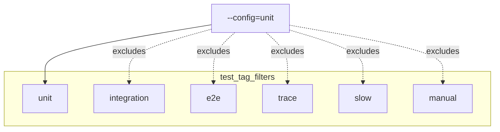
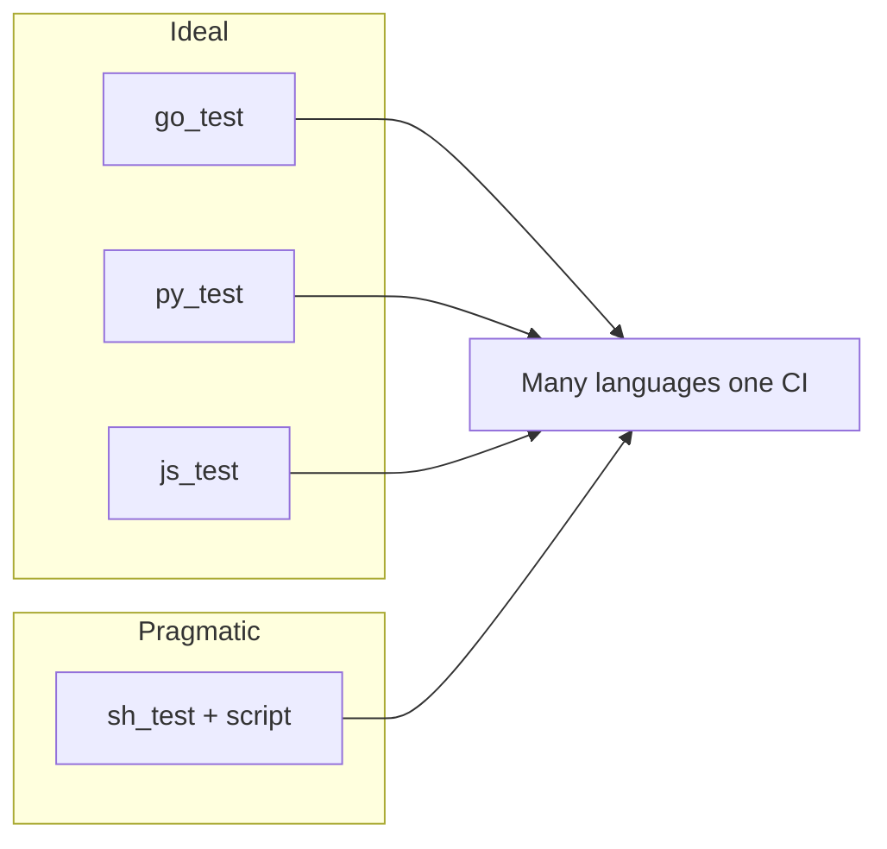

# Test tags, flakes, `requires-network`, and why `sh_test` is a power tool

---

## Tags are routing, not decoration

I treat **tags** as **selectors** that CI and humans use to decide **what runs when**. The workspace wires that through **`.bazelrc`** so the same graph can answer different questions: fast PR gate, integration, browser work, trace-heavy suites.

**Test configs** (excerpt — the important part is the **filter expression**):

```text
test:ci --test_output=errors

test:unit --test_tag_filters=unit,-integration,-e2e,-trace,-slow,-manual
test:integration --test_tag_filters=integration,-e2e,-trace,-slow,-manual
test:e2e --test_tag_filters=e2e
test:trace --test_tag_filters=trace
```

**The subtlety that burned me once:** with **`--config=unit`**, Bazel runs **only** tests that carry the **`unit`** tag. **Untagged tests do not run.** So when I wanted something in the default PR sweep, I had to **add** `tags = ["unit"]` explicitly — including after wiring **frontend ESLint** into the same graph as a **`js_test`**.



---

## What each tag means (how I use it)

<table>
  <thead>
    <tr>
      <th>Tag</th>
      <th>When I use it</th>
    </tr>
  </thead>
  <tbody>
    <tr>
      <td><strong><code>unit</code></strong></td>
      <td>Fast checks: small package tests, smoke <strong><code>sh_test</code></strong>s, config bakers, <strong><code>js_test</code></strong> lint. This is what <strong><code>ci_full.sh</code></strong> runs via <strong><code>bazel test //... --config=unit</code></strong>.</td>
    </tr>
    <tr>
      <td><strong><code>integration</code></strong></td>
      <td>Needs local services, databases, or Compose; often paired with <strong><code>manual</code></strong> until infra is trustworthy.</td>
    </tr>
    <tr>
      <td><strong><code>e2e</code></strong></td>
      <td>Browser / full stack (Cypress-class work — intentionally deferred; see the <strong>Cypress / Tracetest</strong> article later in this series).</td>
    </tr>
    <tr>
      <td><strong><code>trace</code></strong></td>
      <td>Tracetest or trace-validation style suites (same deferral story).</td>
    </tr>
    <tr>
      <td><strong><code>slow</code></strong></td>
      <td>Large timeouts; easy to exclude from PRs even if the test is otherwise <strong><code>unit</code></strong>.</td>
    </tr>
    <tr>
      <td><strong><code>manual</code></strong></td>
      <td>Never runs in a blind <strong><code>//...</code></strong> sweep unless you opt in; <strong><code>--config=unit</code></strong> explicitly excludes it.</td>
    </tr>
    <tr>
      <td><strong><code>requires-network</code></strong></td>
      <td>Convention: the test may hit npm, NuGet, Packagist, Hex, etc. I pair it with <strong><code>unit</code></strong> when the check is still “CI-sized” but not hermetic.</td>
    </tr>
    <tr>
      <td><strong><code>no-sandbox</code></strong></td>
      <td>Gradle, .NET host SDK, or tools that need paths Bazel cannot enumerate — <strong>only</strong> when justified and documented next to the target.</td>
    </tr>
    <tr>
      <td><strong><code>lint</code></strong></td>
      <td>I use this on <strong><code>//src/frontend:lint</code></strong> alongside <strong><code>unit</code></strong> so ESLint stays visible in the tag set without pretending it is a classical unit test.</td>
    </tr>
  </tbody>
</table>

---

## `unit` targets that sit in my graph today

These are the **`unit`**-tagged tests I rely on for **`bazel test //... --config=ci --config=unit --build_tests_only`** (same shape as the **`bazel_ci`** job’s script):

<table>
  <thead>
    <tr>
      <th>Target</th>
      <th>Tags (high level)</th>
    </tr>
  </thead>
  <tbody>
    <tr>
      <td><code>//src/checkout/money:money_test</code></td>
      <td><code>unit</code></td>
    </tr>
    <tr>
      <td><code>//src/shipping:shipping_test</code></td>
      <td><code>unit</code></td>
    </tr>
    <tr>
      <td><code>//src/currency:currency_proto_smoke_test</code></td>
      <td><code>unit</code></td>
    </tr>
    <tr>
      <td><code>//src/email:email_gems_smoke_test</code></td>
      <td><code>unit</code></td>
    </tr>
    <tr>
      <td><code>//src/flagd-ui:flagd_ui_mix_test</code></td>
      <td><code>unit</code>, <code>requires-network</code></td>
    </tr>
    <tr>
      <td><code>//src/quote:quote_composer_smoke_test</code></td>
      <td><code>unit</code>, <code>requires-network</code></td>
    </tr>
    <tr>
      <td><code>//src/react-native-app:rn_js_checks</code></td>
      <td><code>unit</code>, <code>requires-network</code></td>
    </tr>
    <tr>
      <td><code>//src/frontend-proxy:frontend_proxy_config_test</code></td>
      <td><code>unit</code></td>
    </tr>
    <tr>
      <td><code>//src/image-provider:image_provider_config_test</code></td>
      <td><code>unit</code></td>
    </tr>
    <tr>
      <td><code>//src/cart:cart_dotnet_test</code></td>
      <td><code>unit</code>, <code>requires-network</code>, <code>no-sandbox</code></td>
    </tr>
    <tr>
      <td><code>//src/frontend:lint</code></td>
      <td><code>unit</code>, <code>lint</code> (ESLint via <strong><code>js_test</code></strong>)</td>
    </tr>
    <tr>
      <td><code>//tools/bazel/policy:oci_allowlist_test</code></td>
      <td><code>unit</code></td>
    </tr>
  </tbody>
</table>

**Rule for contributors (and for future me):** **Gazelle does not add tags.** Every new **`go_test`**, **`sh_test`**, **`js_test`**, or other runner needs an explicit tag choice after generation.

---

## Network, flakes, and honesty

**`requires-network`** does not mean “flaky is OK”. It means “this action reaches registries”. I still keep scripts **idempotent** and fail **loudly** on missing tools.

When something flakes:

1. **Re-run once** to see if it is infra (registry blip) or logic.  
2. If it is registry noise, consider **caching** (disk cache in CI, vendor dirs where language rules allow).  
3. If it is timeout, bump **`size`** or mark **`slow`** and **exclude** from **`unit`** — do not let a long tail wag the PR graph.

---

## Why I love `sh_test` for polyglot migrations

Native test rules are ideal when they exist. **`sh_test`** is the **honest bridge**: I can invoke **`dotnet test`**, **`mix test`**, **`composer install` + PHP smoke**, **`npm ci` + `tsc` + `jest`**, **`envsubst`** bakers — **without** blocking the migration on a perfect Starlark rule for every ecosystem.

Trade-offs I accept:

- **Host tools** must exist (CI installs them to match the script).  
- **`no-sandbox`** sometimes appears — I document **why** next to the target.  
- **Runfiles** layout surprises newcomers — a later article in this series goes deep on **`TEST_SRCDIR`** and **`$(location …)`**.



---

## Commands I use every week

<Terminal
  title="Shell"
  commands={[
    {
      command: "bazelisk test //... --config=ci --config=unit --build_tests_only",
      output: "# Whole repo unit sweep (matches CI\u2019s test phase)",
    },
    {
      command: "bazelisk query 'attr(\"tags\", \"unit\", tests(//...))'",
      output: "# Targets explicitly tagged unit (useful when debugging filters)",
    },
    {
      command: "bazelisk test //src/cart:cart_dotnet_test --config=ci --config=unit --test_output=all",
      output: "# One noisy test with full output",
    },
  ]}
/>

---

## Interview line

> “I routed tests with **`.bazelrc` tag filters** so PRs run **`unit`** only. **`requires-network`** and **`no-sandbox`** are **documented exceptions** for ecosystem reality — not an excuse to skip hermeticity where Go and protos already give it for free.”
