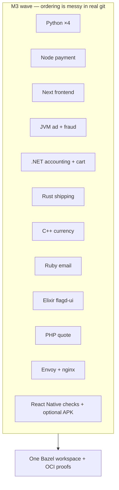

# Milestone M3: when the wave crashed (in a good way)

**M3**, in my story, is the milestone where the OpenTelemetry Astronomy Shop stopped being “a few Go packages in Bazel” and became **a portfolio**: **many languages**, **`BUILD.bazel` everywhere it mattered**, **`oci_image` proofs** for the services I chose to containerize, and **tagged tests** that could survive a real CI conversation.

It is **not** a single commit. In git history it reads as a **long wave** — Python services, Node payment, Next frontend, JVM, .NET, Rust, C++, Ruby, Elixir, PHP, edge proxies (Envoy + nginx), React Native Android edges — each landing with **build files**, **smoke or unit tests**, and often **digest-pinned OCI bases**.

---

## What M3 proved (the claims I can make out loud)

1. **One build tool can stay coherent** across stacks that usually scatter into Make, Gradle, Docker, and “run this script”.  
2. **OCI from Bazel** can be **deterministic enough** for CI: **`rules_oci`**, **`oci.pull`** with **pinned digests**, **`pkg_tar`** / **`js_image_layer`** patterns per ecosystem.  
3. **The hard part is never Starlark syntax** — it is **ecosystem quirks**: Next standalone output, .NET publish vs Alpine musl, Ruby native gems, Elixir releases, PHP extensions, Envoy **`envsubst`** vs baked YAML at build time.

---

## The service surface I brought under Bazel (high level)

Think of M3 as “**application services + edges** in the graph”, each with a **`BUILD.bazel`** story:

<table>
  <thead>
    <tr>
      <th>Area</th>
      <th>Examples of what landed</th>
    </tr>
  </thead>
  <tbody>
    <tr>
      <td><strong>Go</strong></td>
      <td>Checkout, product-catalog — binaries, tests, <strong><code>oci_image</code></strong> for checkout.</td>
    </tr>
    <tr>
      <td><strong>Node / TS</strong></td>
      <td>Payment (<strong>Aspect rules_js</strong> + pnpm lock), frontend (<strong>Next</strong> + heavy <strong><code>next_build</code></strong> rules).</td>
    </tr>
    <tr>
      <td><strong>Python</strong></td>
      <td>recommendation, product-reviews, llm, load-generator — <strong><code>py_binary</code></strong> + <strong><code>oci_image</code></strong> macros.</td>
    </tr>
    <tr>
      <td><strong>JVM</strong></td>
      <td>ad, fraud-detection — deploy JAR layers on distroless Java bases.</td>
    </tr>
    <tr>
      <td><strong>.NET</strong></td>
      <td>accounting, cart — publish trees on <strong>aspnet</strong> base (different from some Dockerfiles’ musl single-file choices).</td>
    </tr>
    <tr>
      <td><strong>Rust / C++</strong></td>
      <td>shipping (<strong>cc</strong> + distroless static), currency — static/dynamic linking lessons.</td>
    </tr>
    <tr>
      <td><strong>Ruby / Elixir / PHP</strong></td>
      <td>email (<strong>Bundler vendor</strong>), flagd-ui (<strong>mix release</strong>), quote (<strong>Composer</strong> + extensions).</td>
    </tr>
    <tr>
      <td><strong>Edges</strong></td>
      <td>frontend-proxy (<strong>baked Envoy YAML</strong>), image-provider (<strong>baked nginx.conf</strong>).</td>
    </tr>
    <tr>
      <td><strong>Mobile</strong></td>
      <td>react-native-app — <strong>JS <code>sh_test</code></strong> (<code>tsc</code> + <code>jest</code>) plus <strong>optional</strong> <strong>Android debug APK</strong> with a <strong>hermetic SDK bundle</strong> (<code>@rn_android_sdk</code>) and <strong>Gradle</strong> <code>assembleDebug</code> (Linux amd64 only; iOS not in Bazel).</td>
    </tr>
  </tbody>
</table>

Not every row has a **published** Bazel image in production — M3’s point is **graph + proof**, not “delete Docker forever”.

---

## What changed vs earlier milestones

<table>
  <thead>
    <tr>
      <th>Before M3</th>
      <th>After M3</th>
    </tr>
  </thead>
  <tbody>
    <tr>
      <td>Mostly <strong>Go</strong> + protos + a thin slice of other languages</td>
      <td><strong>Polyglot application layer</strong> represented in Starlark</td>
    </tr>
    <tr>
      <td>OCI experiments on <strong>one</strong> service</td>
      <td><strong>Many</strong> <code>oci_image</code> targets with <strong>digest-pinned</strong> bases</td>
    </tr>
    <tr>
      <td>Ad-hoc “run this locally”</td>
      <td><strong><code>sh_test</code></strong> and native tests <strong>tagged</strong> for <strong><code>--config=unit</code></strong></td>
    </tr>
  </tbody>
</table>

---

## The command habit (even before CI was “the boss”)

Later, **`bash ./tools/bazel/ci/ci_full.sh`** became the **full** orchestration (see the **M4** article). During M3 I lived in **targeted** builds:

<Terminal
  title="Shell"
  commands={[
    {
      command: "bazelisk build //src/checkout/... //src/payment/... --config=ci",
      output: "",
    },
    {
      command: "bazelisk test //src/checkout/money:money_test --config=ci",
      output: "",
    },
  ]}
/>

As the graph grew, I **collapsed** that habit into scripts so I would not forget a leaf target. **The discipline starts in M3**; **the automation hardens in M4**.

---

## Emotional note (earned)

M3 is where **impostor syndrome peaks** — then breaks. You will see a failure and think “Bazel cannot do mobile” or “Next is impossible” — and often the fix is **one env var**, **one tag**, **one `data = []` entry**, or **`bazel mod tidy`**.

The milestone is **done** when you can **walk the repo** and explain **each oddity** without hand-waving.

---

## Interview line

> “M3 was my **breadth milestone**: I proved **`rules_oci` + language-specific packaging** across **Go, Node, Python, JVM, .NET, Rust, C++, Ruby, Elixir, PHP**, plus **edge config images** and **bounded mobile**. Depth — CI blocking, allowlists, release SBOM — came **next**.”
