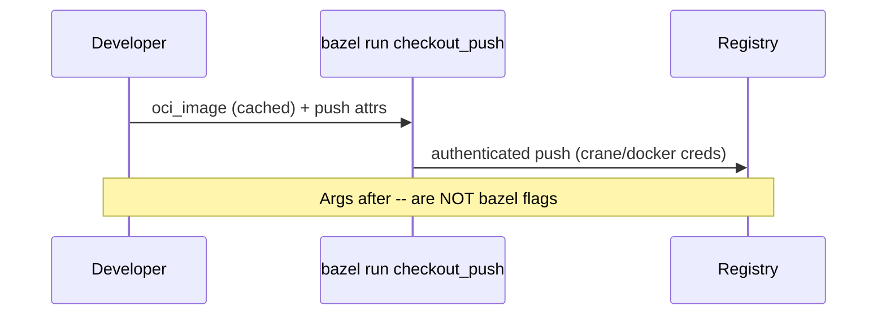

# `oci_push`: why I started with checkout and how registry auth works

**Checkout** is **Go on distroless static** — a small runtime surface, no JVM, no Node server bundle. That makes it the **best first student** for **`oci_push`**: fewer moving parts than Next.js, easier to reason about layers and credentials.

---

## The Bazel targets (image, load, push)

```91:103:src/checkout/BUILD.bazel
# `bazel run //src/checkout:checkout_load` → tarball for `docker load`.
oci_load(
    name = "checkout_load",
    image = ":checkout_image",
    repo_tags = ["otel/demo-checkout:bazel"],
)

# BZ-123 / M4: push pattern (requires registry auth on host — `docker login` / `crane auth`).
# Runtime: bazel run //src/checkout:checkout_push -- --repository ghcr.io/myorg/demo --tag dev
oci_push(
    name = "checkout_push",
    image = ":checkout_image",
)
```

**`oci_load`** materializes **`otel/demo-checkout:bazel`** locally for **`docker run`** / scanners. **`oci_push`** reuses the **same** `oci_image` definition but publishes to a registry you pass at **run** time.

---

## Local push pattern (developer machine)

1. **Authenticate** to your registry (**`docker login`**, **`crane auth`**, or vendor equivalent).  
2. Run **`bazelisk run`** on **`checkout_push`** with **tool flags after `--`**.

<Terminal
  title="Shell"
  commands={[
    {
      command: "bazelisk run --config=ci //src/checkout:checkout_push -- \\",
      output: "# Bazel flags BEFORE -- ; oci_push / crane flags AFTER --",
    },
    {
      command: "--repository ghcr.io/<org>/<name> \\",
      output: "",
    },
    {
      command: "--tag \"$(git rev-parse --short HEAD)\"",
      output: "",
    },
  ]}
/>

**Classic footgun:** putting **`--config=ci`** **after** `--` — everything after `--` goes to the **push tool**, not Bazel. If auth fails, fix **login** first; if args fail, **count the `--`**.



---

## Release workflow (automation on the fork)

A dedicated GitHub Actions workflow runs on **`release: published`** and **`workflow_dispatch`**. At a high level:

1. **Setup** — checkout, Go, Bazelisk, **disk cache** on **`~/.cache/bazel`**.  
2. **Resolve tag** — release tag name, or **`manual`** (dispatch input).  
3. **Policy** — Python script ensures every **`oci.pull` name** in **`MODULE.bazel`** matches a checked-in allowlist (same check **`ci_full.sh`** runs first).  
4. **Build** — `bazelisk build //src/checkout:checkout_image --config=ci`.  
5. **Load** — `bazelisk run //src/checkout:checkout_load --config=ci` → local Docker tag **`otel/demo-checkout:bazel`**.  
6. **SBOM** — Anchore **`sbom-action`** on that image.  
7. **Scan** — Anchore **`scan-action`**, **`fail-build: false`**, **`severity-cutoff: high`** (informational by default — distroless noise is real until you tune waivers).  
8. **Push (optional)** — if secret **`BAZEL_CHECKOUT_PUSH_REPOSITORY`** is set (full path e.g. **`ghcr.io/org/demo-checkout-bazel`**), run:

<Terminal
  title="Shell"
  commands={[
    {
      command: "bazelisk run --config=ci //src/checkout:checkout_push -- --repository \"${REPO}\" --tag \"${TAG}\"",
      output: "",
    },
  ]}
/>

**Registry login** on **`release`**: **`docker/login-action`** to **`ghcr.io`** with **`GITHUB_TOKEN`**.

---

## Why optional push via secret

Forks and learning repos should stay **green** without maintainer registry paths. **No secret → skip push**, still get **SBOM + scan** evidence on the **`otel/demo-checkout:bazel`** artifact loaded in the job.

---

## Commands cheat card

<Terminal
  title="Shell"
  commands={[
    {
      command: "bazelisk build //src/checkout:checkout_image --config=ci",
      output: "",
    },
    {
      command: "bazelisk run //src/checkout:checkout_load --config=ci",
      output: "",
    },
    {
      command: "docker run --rm -p 5050:5050 otel/demo-checkout:bazel",
      output: "",
    },
    {
      command: "bazelisk run --config=ci //src/checkout:checkout_push -- \\",
      output: "# Push (after docker login ghcr.io)",
    },
    {
      command: "--repository ghcr.io/<org>/<repo> --tag v1.2.3",
      output: "",
    },
  ]}
/>

---

## Interview line

> “I used **checkout** as the **`oci_push` pilot** because **Go + distroless** minimizes variables. **CI** builds, **loads**, **SBOMs**, and **scans**; **push** is **gated on a secret** so forks do not need my registry.”
