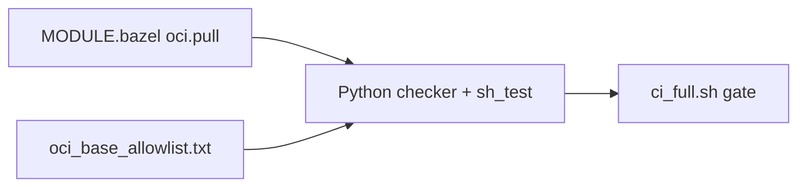

# Milestone M5: allowlist, SBOM, scan, optional push (supply chain without theater)

**M5** in a backlog often sounds enterprise-y. In my fork it became a **credible story** you can **run** and **show**:

1. **OCI base allowlist** — every **`oci.pull` `name`** in **`MODULE.bazel`** must match a checked-in text file. A **Python checker** runs at the start of **`ci_full.sh`** / **`ci_fast.sh`** and in **`sh_test`**.  
2. **Release workflow** — on **GitHub release** (and **manual dispatch**), build **checkout** with Bazel, **load** into Docker, run **Anchore SBOM** + **Anchore scan** (informational by default), and **optionally push** if a repository secret is set.

---

## The allowlist — policy as a diffable text file

**File:** `tools/bazel/policy/oci_base_allowlist.txt` — one **`oci.pull` name** per line (comments allowed with `#`).

**Rules:**

- Every **`oci.pull( name = "…" )`** in **`MODULE.bazel`** must appear in the allowlist.  
- Every allowlist entry must have a matching **`oci.pull`** — no stale lines.  

That **symmetry** stops two failure modes: someone adds a new base image without review, or someone deletes a pull but leaves the policy file lying.

**Example head of the allowlist** (illustrative — the real file may grow):

```text
# Allowed oci.pull repository names in MODULE.bazel (one per line).
distroless_static_debian12_nonroot
dotnet_aspnet_10
envoy_v134_latest
nginx_unprivileged_1290_alpine322_otel
python_312_slim_bookworm
# …
```

**Checker implementation** (behavior in prose): **`check_oci_allowlist.py`** walks up from its path to find **`MODULE.bazel`**, regex-extracts **`oci.pull` names** in file order, loads the allowlist, then errors if **set difference** is non-empty either way.

```22:59:tools/bazel/policy/check_oci_allowlist.py
def extract_oci_pull_names(module_text: str) -> list[str]:
    """Return oci.pull `name =` values in file order."""
    return re.findall(
        r'oci\.pull\(\s*\n\s*name\s*=\s*"([^"]+)"',
        module_text,
        flags=re.MULTILINE,
    )
# ...
    for name in pulled:
        if name not in allow_set:
            errors.append(f"oci.pull name {name!r} is not in {allow_path}")
    for name in allowed:
        if name not in pull_set:
            errors.append(f"Allowlist entry {name!r} has no matching oci.pull in MODULE.bazel")
```

---

## Run the allowlist locally

<Terminal
  title="Shell"
  commands={[
    {
      command: "python3 tools/bazel/policy/check_oci_allowlist.py",
      output: "",
    },
  ]}
/>

Or via Bazel:

<Terminal
  title="Shell"
  commands={[
    {
      command: "bazelisk test //tools/bazel/policy:oci_allowlist_test --config=ci",
      output: "",
    },
  ]}
/>

---

## Why I like the allowlist trick

Reviewers can **see** policy in a **small text file**. CI fails if someone sneaks a new base without updating that file. It is simpler than OPA for a learning repo — and **simple counts**.



---

## Release workflow (what the YAML actually does)

Workflow name on the fork: **“Bazel checkout OCI (release)”**. Triggers: **`release: published`**, **`workflow_dispatch`**. Sketch of steps:

<table>
  <thead>
    <tr>
      <th>Step</th>
      <th>Purpose</th>
    </tr>
  </thead>
  <tbody>
    <tr>
      <td>Checkout + Go + Bazelisk</td>
      <td>Minimal toolchain for <strong>checkout</strong> image</td>
    </tr>
    <tr>
      <td>Disk cache on <code>~/.cache/bazel</code></td>
      <td>Warm repeated release builds</td>
    </tr>
    <tr>
      <td>Resolve tag</td>
      <td>Release tag or manual input</td>
    </tr>
    <tr>
      <td><strong><code>check_oci_allowlist.py</code></strong></td>
      <td>Same policy as PR CI</td>
    </tr>
    <tr>
      <td><strong><code>bazelisk build //src/checkout:checkout_image</code></strong></td>
      <td>Build image</td>
    </tr>
    <tr>
      <td><strong><code>bazelisk run //src/checkout:checkout_load</code></strong></td>
      <td>Load <strong><code>otel/demo-checkout:bazel</code></strong> into Docker</td>
    </tr>
    <tr>
      <td><strong>Anchore <code>sbom-action</code></strong></td>
      <td>SPDX-style SBOM artifact</td>
    </tr>
    <tr>
      <td><strong>Anchore <code>scan-action</code></strong></td>
      <td>Vuln scan; <strong><code>fail-build: false</code></strong>, <strong><code>severity-cutoff: high</code></strong></td>
    </tr>
    <tr>
      <td><strong><code>docker/login-action</code></strong> to GHCR</td>
      <td>On <strong><code>release</code></strong> events</td>
    </tr>
    <tr>
      <td><strong>Optional <code>oci_push</code></strong></td>
      <td>If <strong><code>BAZEL_CHECKOUT_PUSH_REPOSITORY</code></strong> secret is set</td>
    </tr>
  </tbody>
</table>

**Optional push command shape** (when secret present):

<Terminal
  title="Shell"
  commands={[
    {
      command: "bazelisk run --config=ci //src/checkout:checkout_push -- --repository \"${REPO}\" --tag \"${TAG}\"",
      output: "",
    },
  ]}
/>

**Why `fail-build: false` on scan:** distroless and base-image **CVE noise** can swamp a demo repo until you tune **waivers** — but the **instrumentation** exists and the logs are real.

---

## What changed vs M4

<table>
  <thead>
    <tr>
      <th>M4</th>
      <th>M5</th>
    </tr>
  </thead>
  <tbody>
    <tr>
      <td>CI blocks on <strong>build + unit + lint</strong></td>
      <td>Same, plus <strong>explicit supply-chain hooks</strong> on <strong>release</strong></td>
    </tr>
    <tr>
      <td>OCI bases pinned in <strong><code>MODULE.bazel</code></strong> only</td>
      <td>Pins + <strong>allowlist enforcement</strong> in CI</td>
    </tr>
    <tr>
      <td>Push story <strong>documented</strong> for developers</td>
      <td><strong>Automated</strong> SBOM/scan path; push <strong>opt-in</strong> via secret</td>
    </tr>
  </tbody>
</table>

---

## Commands cheat card

<Terminal
  title="Shell"
  commands={[
    {
      command: "python3 tools/bazel/policy/check_oci_allowlist.py",
      output: "# Same check PRs run first",
    },
    {
      command: "bazelisk test //tools/bazel/policy:oci_allowlist_test --config=ci",
      output: "# Bazel-wrapped test",
    },
  ]}
/>

---

## Interview line

> “I didn’t just **pin digests** — I **enforce** that every **`oci.pull` name** appears in a **reviewable allowlist**, and on **release** I **SBOM + scan** the Bazel-built checkout image. **Gating** on CVEs is **tunable** so the pipeline stays honest without becoming theater.”
