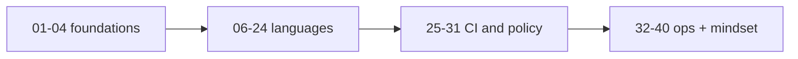

# Appendix: cheat sheet, reading order, closing the loop

---

## Ultra-short command cheat sheet

If you have the **OpenTelemetry Astronomy Shop + Bazel fork** checked out:

```bash
# Workspace sanity
bazelisk build //:smoke --config=ci

# Protos
bazelisk build //pb:demo_proto //pb:go_grpc_protos --config=ci

# Unit tests (whole repo, tagged)
bazelisk test //... --config=ci --config=unit --build_tests_only

# Full CI script (local parity with GitHub bazel_ci)
bash ./tools/bazel/ci/ci_full.sh

# Faster loop (skips most oci_image builds)
bash ./tools/bazel/ci/ci_fast.sh

# OCI proof (example)
bazelisk build //src/checkout:checkout_image --config=ci
bazelisk run  //src/checkout:checkout_load --config=ci

# OCI allowlist
python3 tools/bazel/policy/check_oci_allowlist.py

# Gazelle (Go)
bazelisk run //:gazelle -- update src/checkout src/product-catalog
```

**Make shortcuts:** `make bazel-ci-full`, `make bazel-ci-fast`, `make bazel-test-unit`, `make bazel-check-oci-allowlist`.

---

## What to read in this knowledge base

**Suggested order:**

1. **01–04** — what the demo is, what existed before Bazel, core ideas.  
2. **06–08** — governance, M0/M1 (smoke, protos).  
3. **09–24** — language and edge **lanes** (Go, Node, Python, JVM, .NET, Rust, C++, Ruby, Elixir, PHP, Next, Envoy/nginx, React Native).  
4. **25** — **test tags** (read before trusting **`--config=unit`**).  
5. **26–31** — **M3 / M4 / M5** narrative: breadth, dual OCI, push pilot, CI boss, allowlist+SBOM, remote cache.  
6. **32–33** — contributor shortcuts, **deferred** Cypress/Tracetest.  
7. **34–35** — debugging + interview patterns (**bookmark these**).  
8. **36** (this file) — cheat sheet.  
9. **37–40** — runfiles, lockfile social contract, reading Bazel errors, git history as syllabus.

There is **no chapter 05** in this numbering (intentional gap from the original planning series).

**Outside this narrative** (if you maintain the repo): treat **`MODULE.bazel`**, **`MODULE.bazel.lock`**, **`.bazelrc`**, **`BUILD.bazel`**, and **`.github/workflows/checks.yml`** as the **source of truth** — the articles explain *why* those files look that way.

---

## Closing thought

I learned Bazel by **doing an unfairly hard repo on purpose**. If you reproduce even **half** of this journey on your own machine, you will walk into rooms sounding like someone who has **touched the graph**, not someone who only watched a webinar.


