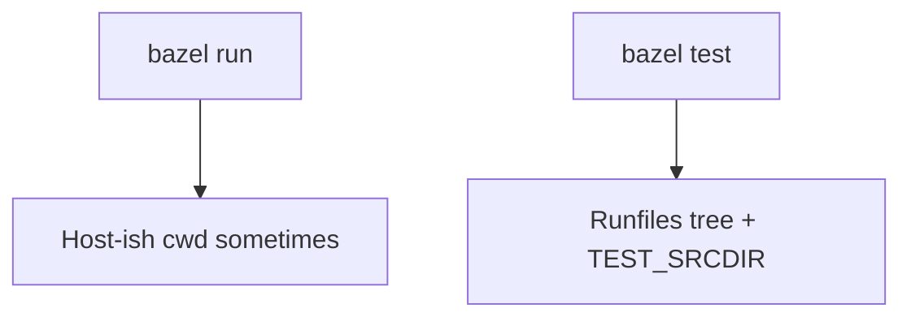

# Starlark edge: runfiles, `location`, and why shell scripts “work in run” but “fail in test”

If you only ever run **`bazel run`**, the world feels friendly. The moment you run **`bazel test`** on a **`sh_test`**, you meet **runfiles**.

---

## What runfiles are

Bazel lays out a directory tree that contains **exactly** the inputs your action declared under **`srcs`**, **`data`**, and **`deps`**. Paths look different from your repo checkout — often under **`$TEST_SRCDIR/$TEST_WORKSPACE/...`**. Your script must not assume **`../../MODULE.bazel`** from cwd unless you compute that carefully.

**Environment variables** you will see in tests (not an exhaustive spec — check Bazel docs for your version):

<table>
  <thead>
    <tr>
      <th>Variable</th>
      <th>Role</th>
    </tr>
  </thead>
  <tbody>
    <tr>
      <td><strong><code>TEST_SRCDIR</code></strong></td>
      <td>Root of the runfiles tree</td>
    </tr>
    <tr>
      <td><strong><code>TEST_WORKSPACE</code></strong></td>
      <td>Workspace name segment under runfiles</td>
    </tr>
    <tr>
      <td><strong><code>PWD</code></strong></td>
      <td>Often the <strong>execroot</strong> or a temp dir — <strong>do not</strong> trust it to equal your git root</td>
    </tr>
  </tbody>
</table>

---

## Why my Python allowlist checker walks upward for `MODULE.bazel`

In **`check_oci_allowlist.py`** I resolve the repo root by walking parents until **`MODULE.bazel`** exists. That pattern works both:

- when invoked directly: **`python3 tools/bazel/policy/check_oci_allowlist.py`**  
- when invoked from a **`sh_test`** runfile layout (different cwd, same upward search)

That is intentional — I got tired of scripts that only worked one way.

---

## `$(location //label)` vs hard-coded paths

In **`genrule`** and some tests, **`$(location …)`** expands to the correct runfile or output path at **analysis** time. When a newcomer hard-codes **`src/foo/bar`**, CI breaks on Linux because the sandbox path is not **`/home/you/...`**.

**Fix:** declare inputs in **`data = [...]`** / **`deps`** and reference them through **`location`** or runfiles libraries (language-specific).

---

## Practical debugging recipe

1. **`bazelisk test //pkg:test --test_output=all`**  
2. Print **`pwd`**, **`echo "$TEST_SRCDIR"`**, and **`ls`** (temporarily) in the test script.  
3. Compare to what you **declared** in **`BUILD.bazel`**.  
4. Fix by **adding missing `data`** or switching to **runfiles-relative** resolution.

**React Native JS checks** in this fork iterate **`TEST_SRCDIR/*`** looking for **`src/react-native-app/package.json`** — that is the same lesson in bash form.

---

## Interview line

> “**`bazel run`** forgives sloppy paths; **`bazel test`** does not. I either use **runfiles-aware** resolution or **`$(location)`** — and I **declare every input**.”
