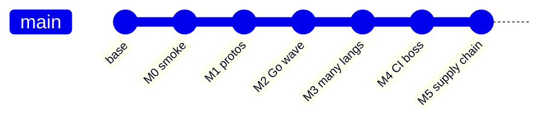

# Git history as my lab notebook (annotated commit arc)

I committed in **milestone-shaped chunks**. If you are replaying the migration, **`git log --oneline`** is a syllabus — not because git is fancy, but because **ordered narrative** beats a single “big bang” squash for learning.

---

## The arc I actually see

<table>
  <thead>
    <tr>
      <th>Milestone</th>
      <th>What moved in the graph</th>
    </tr>
  </thead>
  <tbody>
    <tr>
      <td><strong>M0</strong></td>
      <td>Bazel <strong>smoke</strong> in CI (early days could be non-blocking while wiring Bzlmod).</td>
    </tr>
    <tr>
      <td><strong>M1</strong></td>
      <td><strong>Proto</strong> graph + CI gate evolution — <strong><code>pb</code></strong> targets as the spine.</td>
    </tr>
    <tr>
      <td><strong>M2</strong></td>
      <td>First <strong>language wave</strong> solid (Go services deeply integrated).</td>
    </tr>
    <tr>
      <td><strong>M3</strong></td>
      <td>Long series: payment, frontend, Python fleet, JVM, .NET, Rust, C++, Ruby, Elixir, PHP, React Native Android edges, Envoy/nginx — <strong>BUILD files</strong>, <strong>tests</strong>, <strong>oci_image</strong> proofs.</td>
    </tr>
    <tr>
      <td><strong>M4</strong></td>
      <td>CI switches to <strong>blocking</strong> <strong><code>bazel_ci</code></strong> + <strong><code>ci_full.sh</code></strong> (full toolchain on Ubuntu, disk cache, curated <strong><code>bazel build</code></strong> list, <strong><code>unit</code></strong> tests, <strong><code>//:lint</code></strong>).</td>
    </tr>
    <tr>
      <td><strong>M5</strong></td>
      <td><strong>Closure</strong>: OCI <strong>allowlist</strong> enforcement, <strong>release</strong> workflow with <strong>SBOM</strong> + <strong>scan</strong>, optional <strong><code>oci_push</code></strong>, <strong>Make</strong> wrappers, <strong>remote cache</strong> story.</td>
    </tr>
  </tbody>
</table>

Names (**M0**–**M5**) are **my** chapter headings — upstream may use different ticket IDs. The **shape** is what matters: **spine → breadth → CI boss → supply chain**.

---

## How to use this as a learner

Pick a commit, check it out in a **worktree**, and diff against its parent — but **filter** to the files that tell the build story:

<Terminal
  title="Shell"
  commands={[
    {
      command: "git show --stat <commit>",
      output: "",
    },
    {
      command: "git diff <commit>^..<commit> -- '*.bazel' 'MODULE.bazel' 'MODULE.bazel.lock' '.github/workflows/*.yml' '.bazelrc'",
      output: "",
    },
  ]}
/>

You will see **only build / CI motion**, which is the point.

---

## Why ordered commits matter for portfolios

Interviewers sometimes ask: *“Show me how you broke down a large change.”*  
A clean commit series is evidence you can **ship incrementally** — the same skill enterprises need for monorepo migrations.

**Anti-pattern:** one giant squash titled “bazel” with 400 files — it **hides** judgment.

---

## Interview line

> “I treat **git history** as **documentation**: each milestone is a **slice** you can **check out** and **diff**. That is how I prove I did not ‘mysteriously’ end up with Bazel — I **landed** it in **stages**.”

---

**Series:** start at [`01-the-opentelemetry-astronomy-shop-demo.md`](/docs/Knowledge-base/projects/Bazel-integration/01-the-opentelemetry-astronomy-shop-demo) · [`README.md`](/docs/Knowledge-base/projects/Bazel-integration/README) for the full index.
