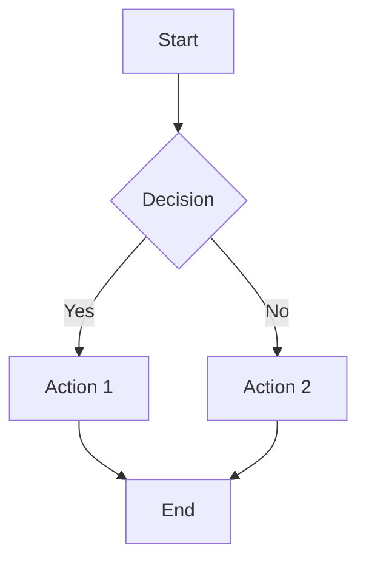
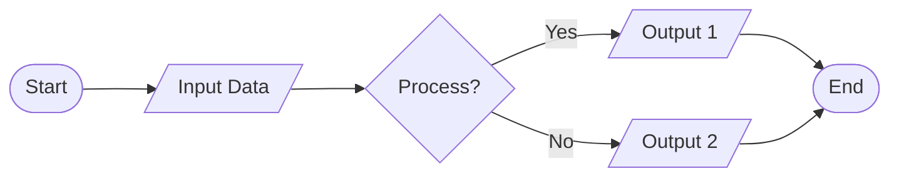
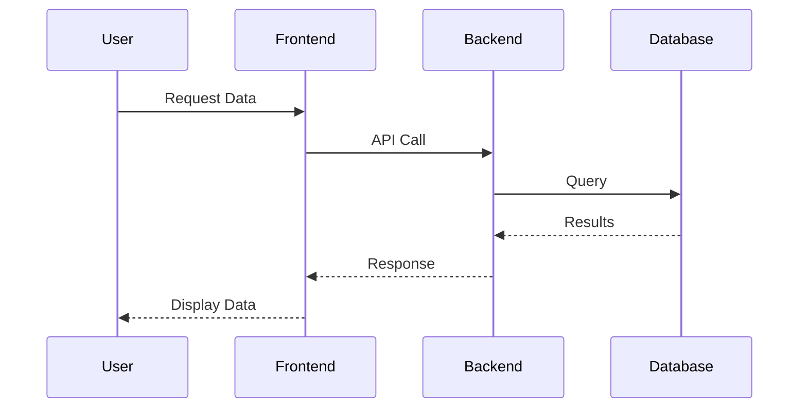
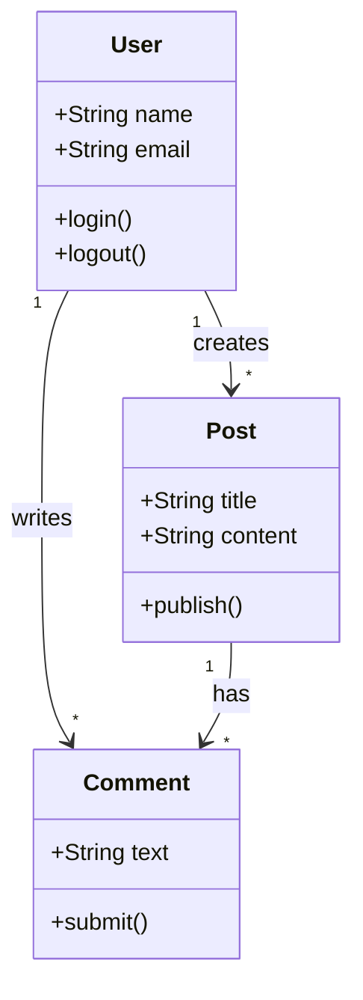
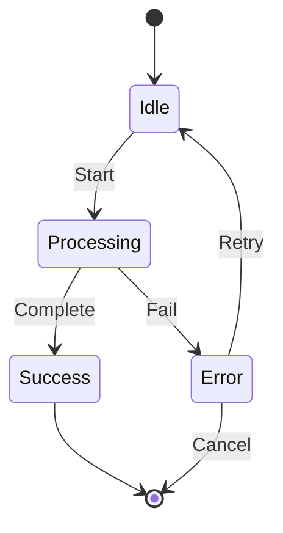
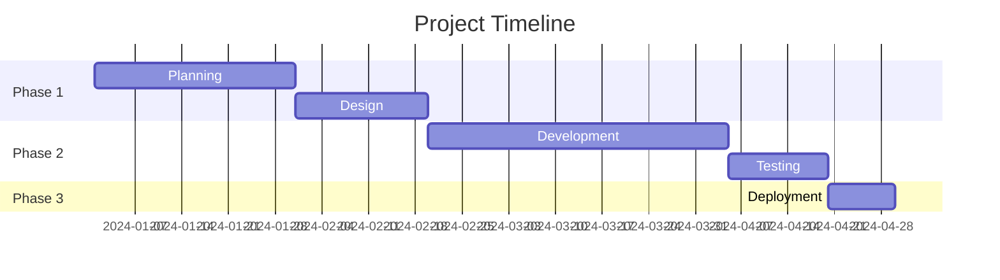
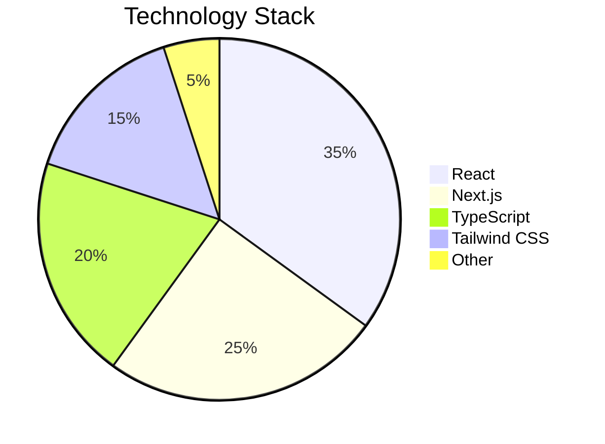
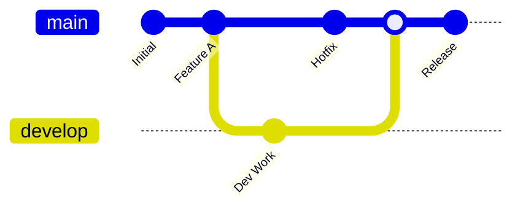
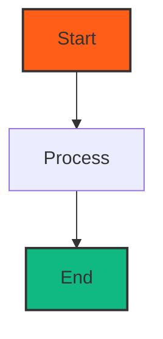
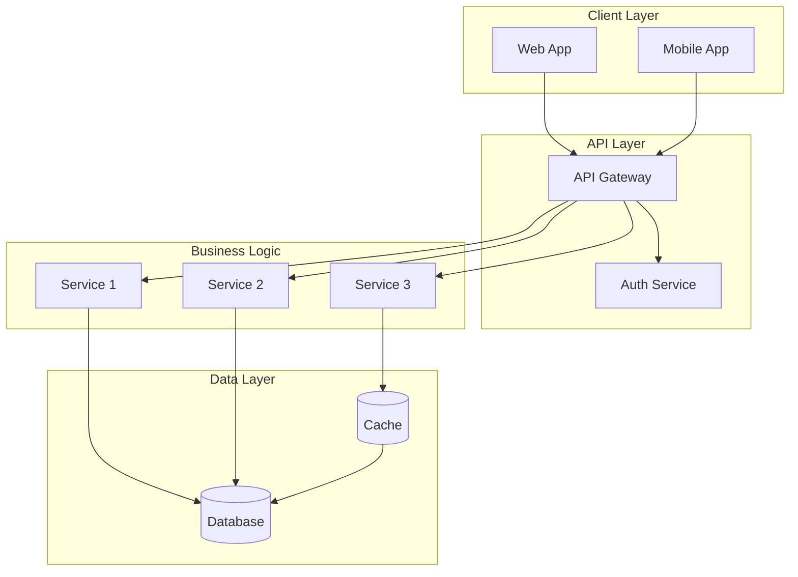

<Callout type="error" title="Warning">
This feature is still experimental and may not work as expected. 
</Callout>

# Mermaid Diagrams

Mermaid diagrams allow you to create beautiful, text-based diagrams directly in your MDX documentation. Flowcharts, sequence diagrams, class diagrams, and more - all with simple text syntax.

## Overview

Mermaid is a diagramming and charting tool that uses text and code to generate diagrams. You can create complex diagrams using simple markdown-like syntax, and they'll automatically render with theme support.

## Features

- ✅ **Theme Support**: Automatically matches your website's theme (light/dark)
- ✅ **Text-Based**: Write diagrams using simple text syntax
- ✅ **Multiple Diagram Types**: Flowcharts, sequence diagrams, class diagrams, Gantt charts, and more
- ✅ **Responsive**: Adapts to different screen sizes
- ✅ **No External Tools**: Create diagrams directly in your MDX files
- ✅ **Styled Container**: Beautiful bordered container matching your theme

## Basic Usage

Simply use a mermaid code block in your MDX:

````mdx

````

**Rendered Result:**


## Diagram Types

### Flowcharts

Flowcharts are perfect for showing processes, workflows, and decision trees.

**Example:**

````mdx

````

**Rendered Result:**



### Sequence Diagrams

Sequence diagrams show interactions between objects over time.

**Example:**

````mdx

````

**Rendered Result:**


### Class Diagrams

Class diagrams show the structure of classes and their relationships.

**Example:**

````mdx

````

**Rendered Result:**


### State Diagrams

State diagrams show the different states of a system.

**Example:**

````mdx

````

**Rendered Result:**


### Gantt Charts

Gantt charts show project timelines and schedules.

**Example:**

````mdx

````

**Rendered Result:**


### Pie Charts

Pie charts show proportional data.

**Example:**

````mdx

````

**Rendered Result:**


### Git Graphs

Git graphs show branch and commit history.

**Example:**

````mdx

````

**Rendered Result:**


## Syntax Reference

### Flowchart Shapes

- `[Rectangle]` - Rectangle node
- `(Round edges)` - Rounded rectangle
- `([Stadium])` - Stadium shape
- `[[Subroutine]]` - Subroutine
- `[(Database)]` - Cylinder/Database
- `((Circle))` - Circle
- `{Diamond}` - Diamond/Decision
- `{{Hexagon}}` - Hexagon
- `[/Parallelogram/]` - Parallelogram
- `[\Trapezoid\]` - Trapezoid
- `[/Trapezoid Alt\]` - Trapezoid (alt)
- `[>Flag]` - Flag

### Arrows

- `-->` - Solid arrow
- `-.->` - Dotted arrow
- `==>` - Thick arrow
- `--` - Solid line
- `-.-` - Dotted line
- `==` - Thick line

### Styling

You can style nodes with classes:

````mdx

````

**Rendered Result:**


## Complete Examples

### System Architecture Flowchart

````mdx

````

**Rendered Result:**


### Authentication Sequence

````mdx
```mermaid
sequenceDiagram
    autonumber
    User->>+Login Page: Enter credentials
    Login Page->>+Auth Service: Validate credentials
    Auth Service->>+Database: Query user
    Database-->>-Auth Service: User data
    Auth Service->>Auth Service: Verify password
    alt Valid credentials
        Auth Service->>Auth Service: Generate JWT token
        Auth Service-->>-Login Page: Success + Token
        Login Page-->>-User: Redirect to dashboard
    else Invalid credentials
        Auth Service-->>-Login Page: Error message
        Login Page-->>-User: Show error
    end
```
````

**Rendered Result:**

```mermaid
sequenceDiagram
    autonumber
    User->>+Login Page: Enter credentials
    Login Page->>+Auth Service: Validate credentials
    Auth Service->>+Database: Query user
    Database-->>-Auth Service: User data
    Auth Service->>Auth Service: Verify password
    alt Valid credentials
        Auth Service->>Auth Service: Generate JWT token
        Auth Service-->>-Login Page: Success + Token
        Login Page-->>-User: Redirect to dashboard
    else Invalid credentials
        Auth Service-->>-Login Page: Error message
        Login Page-->>-User: Show error
    end
```

## Theme Support

Mermaid diagrams automatically adapt to your website's theme:

- **Light Mode**: Uses default Mermaid theme with light backgrounds
- **Dark Mode**: Uses dark Mermaid theme with dark backgrounds
- **Primary Color**: Uses your theme's primary color (#FF5E19) for highlights

The theme switches automatically when you toggle between light and dark modes.

## Best Practices

1. **Keep diagrams simple**: Complex diagrams can be hard to read
2. **Use descriptive labels**: Make node and edge labels clear and meaningful
3. **Organize with subgraphs**: Use subgraphs to group related elements
4. **Add titles**: Use titles to provide context
5. **Test both themes**: Ensure diagrams look good in both light and dark modes
6. **Use appropriate diagram types**: Choose the right diagram type for your use case

## Common Patterns

### Decision Tree

````mdx
```mermaid
flowchart TD
    Start([Start]) --> Check{Check Condition}
    Check -->|True| Action1[Action 1]
    Check -->|False| Action2[Action 2]
    Action1 --> End([End])
    Action2 --> End
```
````

### Process Flow

````mdx
```mermaid
flowchart LR
    A[Step 1] --> B[Step 2]
    B --> C[Step 3]
    C --> D[Step 4]
    D --> E[Step 5]
```
````

### Component Relationships

````mdx
```mermaid
graph TB
    A[Component A] --> B[Component B]
    A --> C[Component C]
    B --> D[Component D]
    C --> D
```
````

## Troubleshooting

### Diagram Not Rendering

- Check that the mermaid code block syntax is correct
- Ensure the diagram syntax is valid Mermaid syntax
- Check browser console for errors
- Verify that `mdx-mermaid` is properly configured

### Theme Not Matching

- The diagram theme automatically matches your website theme
- If it doesn't match, check that `next-themes` is properly configured
- The diagram uses the same theme as the rest of your site

### Diagram Too Large

- Use subgraphs to organize large diagrams
- Break complex diagrams into multiple smaller diagrams
- Consider using different diagram types for different aspects

## Resources

- [Mermaid Documentation](https://mermaid.js.org/) - Complete Mermaid syntax reference
- [Mermaid Live Editor](https://mermaid.live/) - Test your diagrams online
- [Mermaid Examples](https://mermaid.js.org/ecosystem/tutorials.html) - Tutorials and examples

## Next Steps

- [Excalidraw Diagrams](/docs/guide/features/excalidraw) - Learn about interactive Excalidraw diagrams
- [Tabbed Content](/docs/guide/features/tabbed-content) - Learn about multi-tab sections
- [Code Blocks](/docs/guide/features/code-blocks) - Learn about syntax highlighting

