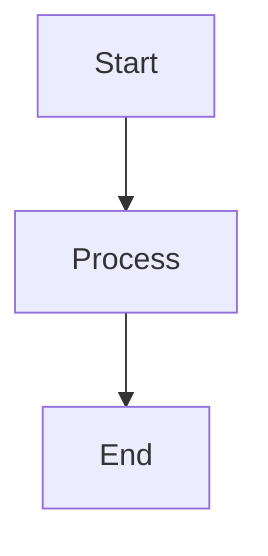

# Features Overview

Your portfolio website includes many powerful features to enhance your documentation and blog posts.

## Available Features

### Content Components

- **Callout Components** - Styled information boxes (info, success, warning, error, note, danger)
- **Excalidraw Diagrams** - Interactive diagrams with zoom and fullscreen
- **Mermaid Diagrams** - Text-based diagrams (flowcharts, sequence diagrams, class diagrams, etc.)
- **Tabbed Content** - Switch between different methods/interfaces
- **Highlight Marker** - Interactive text highlighting that activates when sections are reached
- **Terminal** - Interactive terminal simulation with auto-typing commands
- **Code Blocks** - Syntax highlighting with copy functionality
- **Images & Videos** - Enhanced media components with hover effects

### Navigation Features

- **Global Search** - Search across all documentation
- **Table of Contents** - Auto-generated from headings
- **Sidebar Navigation** - Hierarchical, collapsible navigation
- **Overview Pages** - Clickable section titles
- **Metadata Card** - Display author, read time, last updated, and tags

### System Features

- **Dark Mode** - Full theme support
- **Responsive Design** - Works on all devices
- **Reading Progress** - Progress bar at top of pages
- **Prev/Next Navigation** - Navigate between documents

## Feature Documentation

Each feature has detailed documentation with examples:

- [Callout Components](/docs/guide/features/callouts) - Styled information boxes
- [Excalidraw Diagrams](/docs/guide/features/excalidraw) - Interactive diagrams
- [Mermaid Diagrams](/docs/guide/features/mermaid) - Text-based diagrams
- [Tabbed Content](/docs/guide/features/tabbed-content) - Multi-tab sections
- [Highlight Marker](/docs/guide/features/highlight-marker) - Interactive text highlighting
- [Terminal](/docs/guide/features/terminal) - Interactive terminal simulation
- [Code Blocks](/docs/guide/features/code-blocks) - Syntax highlighting
- [Images & Videos](/docs/guide/features/images-videos) - Media components
- [Global Search](/docs/guide/features/search) - Search functionality
- [Table of Contents](/docs/guide/features/table-of-contents) - Auto-generated TOC
- [Metadata Card](/docs/guide/features/metadata-card) - Author, read time, and tags display

## Quick Examples

### Callout

```mdx
<Callout type="info" title="Tip">
This is an informational callout.
</Callout>
```

### Excalidraw Diagram

```mdx
<ExcalidrawDiagram 
  src="/assets/docs/other/diagram.excalidraw"
  caption="Architecture diagram"
  initialZoom={0.5}
/>
```

### Mermaid Diagram

````mdx

````

### Tabbed Content

```mdx
<TabbedContent>
  <TabPanel id="method1" label="Method 1">
    Content for method 1
  </TabPanel>
  <TabPanel id="method2" label="Method 2">
    Content for method 2
  </TabPanel>
</TabbedContent>
```

### Highlight Marker

```mdx
Follow these <Highlight color="orange">critical steps</Highlight> to ensure success.
```

### Terminal

```mdx
<Terminal
  commands={[
    { command: 'npm install', output: 'added 250 packages' }
  ]}
/>
```

### Code Block

````mdx
```javascript
function example() {
  return "Hello, World!";
}
```
````

## Next Steps

Explore each feature in detail:

- [Callout Components](/docs/guide/features/callouts)
- [Excalidraw Diagrams](/docs/guide/features/excalidraw)
- [Mermaid Diagrams](/docs/guide/features/mermaid)
- [Tabbed Content](/docs/guide/features/tabbed-content)
- [Highlight Marker](/docs/guide/features/highlight-marker)
- [Terminal](/docs/guide/features/terminal)
- [Code Blocks](/docs/guide/features/code-blocks)
- [Images & Videos](/docs/guide/features/images-videos)
- [Metadata Card](/docs/guide/features/metadata-card)


