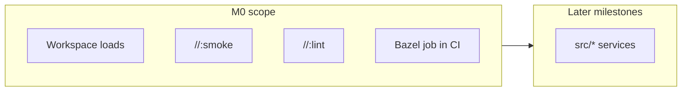
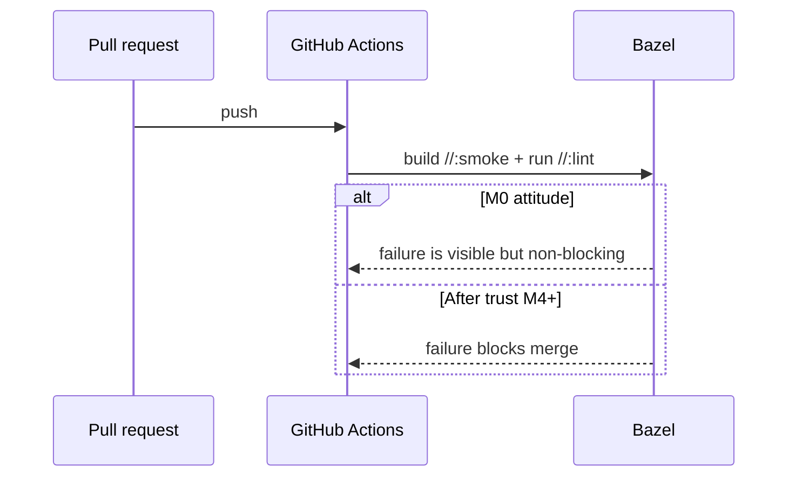
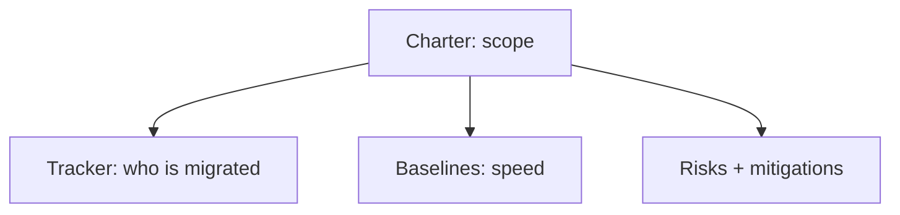
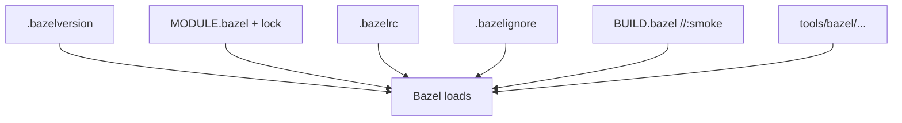
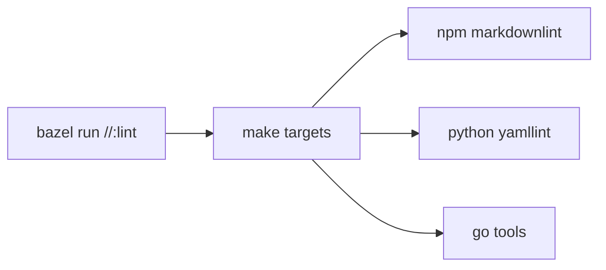
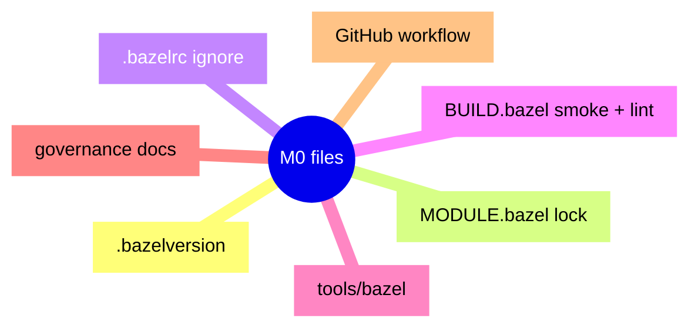

# Milestone M0: smoke, lint wrappers, and CI that whispers before it shouts

Bzlmod and `MODULE.bazel` are covered in [Part B of the planning chapter](/docs/Knowledge-base/projects/Bazel-integration/03-how-i-used-the-planning-doc-series#part-b-bzlmod-and-the-workspace-loading-layer). There is no separate chapter 05—it was removed so that material stays in one place.

This chapter is the **first landing** story: what “**M0**” means in this fork, **what files appeared**, **which task IDs** they map to, and **why CI started as a whisper**.

<DocImage
  src="/assets/docs/knowledge-base/bazel-integration/06-m0-smoke-job.png"
  alt="06 m0 smoke job"
  caption="06 m0 smoke job"
/>

---

## What M0 means in one sentence

> **Bazel runs in the repo** — you can load the workspace, build a trivial target, and optionally run lint through Bazel — and **CI runs that path** without blocking the whole merge queue on day one.

**Not in M0 yet:** migrating real services (`checkout`, `frontend`, …). Docker Compose and the Makefile stay the **boss** for “run the Astronomy Shop.” M0 only proves **the Bazel engine is plugged in**.



---

## Why I wanted CI to “whisper” first

If the first Bazel job **blocks** every PR while I am still learning, I train the team to **ignore** or **fight** Bazel. Better pattern:

1. **Run** the job on every relevant PR so it is **visible**.  
2. Set **`continue-on-error: true`** so a red Bazel line does **not** veto unrelated fixes.  
3. Once the graph is **trusted**, flip to **blocking** (that is the **M4** story later).



---

## Program setup (Epic A) — the human paperwork

Before touching Starlark, I locked **scope** and **inventory** so future me could not pretend the migration was “just configs.”

<table>
  <thead>
    <tr>
      <th>ID</th>
      <th>What I needed</th>
      <th>What it gave me</th>
    </tr>
  </thead>
  <tbody>
    <tr>
      <td><strong>BZ-001</strong></td>
      <td>Charter</td>
      <td><strong>Purpose:</strong> Bazel becomes the main <strong>build/test</strong> engine; <strong>Compose</strong> stays for <strong>running</strong> the demo during the transition. <strong>Scope:</strong> build graph, tests, protos, images, CI — not random product behavior changes. <strong>Branches:</strong> <code>main</code> + optional <code>feat/bazel-*</code> for big chunks; short-lived PRs preferred. <strong>Per-service “done”:</strong> build in Bazel, tests where they exist (with tags), image in Bazel or a written waiver, <strong>runtime parity</strong> with the old path unless we mean to change it.</td>
    </tr>
    <tr>
      <td><strong>BZ-002</strong></td>
      <td>Service tracker</td>
      <td>A <strong>table of every major <code>src/*</code> service</strong>: language, how it used to build (Dockerfile, Gradle, …), proto yes/no, status starting at <strong>NS</strong> (not started). This became my <strong>scoreboard</strong>.</td>
    </tr>
    <tr>
      <td><strong>BZ-003</strong></td>
      <td>Baselines</td>
      <td>A place to write <strong>numbers</strong>: cold vs warm <code>make build</code>, trace test duration, <code>bazelisk build //:smoke</code>, <code>bazelisk run //:lint</code>, plus a sample CI run ID. Empty cells at first are fine — the habit is <strong>measure before you argue about speed</strong>.</td>
    </tr>
    <tr>
      <td><strong>BZ-004</strong></td>
      <td>Risk register</td>
      <td>Six risks I actually believed in (rule maturity per language, <strong>dual pipeline</strong> drift, cache poisoning, flaky trace tests, onboarding fear, <strong>non-hermetic lint</strong> skew) — each with a <strong>mitigation</strong> I could repeat in PR reviews.</td>
    </tr>
  </tbody>
</table>



---

## Workspace bootstrap (Epic B) — files that make Bazel exist

<table>
  <thead>
    <tr>
      <th>ID</th>
      <th>Piece</th>
      <th>What we did</th>
    </tr>
  </thead>
  <tbody>
    <tr>
      <td><strong>BZ-010</strong></td>
      <td><strong><code>.bazelversion</code></strong></td>
      <td>Pinned <strong>Bazel 7.4.1</strong> (check your tree — this is the pin I used). Everyone runs <strong><code>bazelisk</code></strong> so that file is the contract.</td>
    </tr>
    <tr>
      <td><strong>BZ-011</strong></td>
      <td><strong><code>MODULE.bazel</code></strong></td>
      <td>Declared <strong><code>module(name = "otel_demo", version = "0.0.0")</code></strong> — Bzlmod module identity. Language rules (<code>rules_go</code>, <code>protobuf</code>, …) arrive in <strong>M1</strong> and after.</td>
    </tr>
    <tr>
      <td><strong>BZ-012</strong></td>
      <td><strong>Root <code>BUILD.bazel</code> + smoke</strong></td>
      <td><strong><code>genrule</code></strong> <code>//:smoke</code> writes <code>smoke.txt</code> with content <strong><code>bazel-m0-smoke-ok</code></strong>. If this fails, the workspace is not healthy.</td>
    </tr>
    <tr>
      <td><strong>BZ-013</strong></td>
      <td><strong><code>.bazelrc</code></strong></td>
      <td><strong><code>common --enable_bzlmod</code></strong>, <strong><code>build:ci</code></strong> (color, no curses), placeholders for <code>dev</code> / <code>release</code> / <code>integration</code>, <strong><code>test:ci --test_output=errors</code></strong>. CI passes <strong><code>--config=ci</code></strong>.</td>
    </tr>
    <tr>
      <td><strong>BZ-014</strong></td>
      <td><strong><code>.bazelignore</code></strong></td>
      <td>Stops Bazel from walking huge trees: <code>.git</code>, <code>node_modules</code> (root + frontend/payment/RN), Bazel symlinks, RN Pods, <code>.venv</code>, <code>src/shipping/target</code>, <code>.gradle</code>, <code>.next</code>, <code>out</code>. <strong>Faster <code>query</code> and analysis.</strong></td>
    </tr>
    <tr>
      <td><strong>BZ-015</strong></td>
      <td><strong><code>tools/bazel/</code></strong> skeleton</td>
      <td>Folders like <strong><code>defs/</code></strong>, <strong><code>ci/</code></strong>, <strong><code>platforms/</code></strong> plus <strong><code>lint/*.sh</code></strong> — a place for shared Starlark and shell glue to grow.</td>
    </tr>
    <tr>
      <td><strong>BZ-016</strong></td>
      <td><strong>Build style note</strong></td>
      <td>Prefer <strong>Buildifier</strong> on <code>BUILD.bazel</code> / <code>.bzl</code>, Apache headers on new files — small discipline, big diffs later.</td>
    </tr>
  </tbody>
</table>

**Smoke target** (same idea as in the repo):

```python
genrule(
    name = "smoke",
    outs = ["smoke.txt"],
    cmd = "echo bazel-m0-smoke-ok > $@",
)
```

<Terminal
  title="Shell"
  commands={[
    {
      command: "bazelisk version",
      output: "",
    },
    {
      command: "bazelisk build //:smoke --config=ci",
      output: "",
    },
    {
      command: "bazelisk query //...",
      output: "",
    },
  ]}
/>



---

## Hygiene targets (Epic C) — `sh_binary` bridges to Make

I exposed **lint and checks** as Bazel targets that **delegate to Make**, so **`bazel run //:lint`** and **`make check`** stay aligned.

<table>
  <thead>
    <tr>
      <th>ID</th>
      <th>Target</th>
      <th>What it runs</th>
    </tr>
  </thead>
  <tbody>
    <tr>
      <td><strong>BZ-020</strong></td>
      <td><strong><code>//:markdownlint</code></strong></td>
      <td><code>make markdownlint</code> (via <code>tools/bazel/lint/markdownlint.sh</code>)</td>
    </tr>
    <tr>
      <td><strong>BZ-021</strong></td>
      <td><strong><code>//:yamllint</code></strong></td>
      <td><code>make yamllint</code></td>
    </tr>
    <tr>
      <td><strong>BZ-022</strong></td>
      <td><strong><code>//:misspell</code></strong>, <strong><code>//:checklicense</code></strong></td>
      <td><code>make misspell</code> / <code>make checklicense</code> (Go tools built under <code>internal/tools</code>)</td>
    </tr>
    <tr>
      <td><strong>BZ-023</strong></td>
      <td><strong><code>//:sanitycheck</code></strong></td>
      <td><code>python3 internal/tools/sanitycheck.py</code></td>
    </tr>
    <tr>
      <td><strong>BZ-024</strong></td>
      <td><strong><code>//:lint</code></strong></td>
      <td>All of the above <strong>in order</strong> — see script below</td>
    </tr>
  </tbody>
</table>

**Meta `//:lint` script** (core idea — runs from repo root):

```bash
ROOT="${BUILD_WORKSPACE_DIRECTORY:?Run with: bazel run //:lint}"
cd "$ROOT"
make markdownlint
make yamllint
make misspell
make checklicense
exec python3 internal/tools/sanitycheck.py
```

**Important:** `bazel run` sets **`BUILD_WORKSPACE_DIRECTORY`** for you. If you run the shell script by hand, you must `cd` to the repo root yourself.

**Design choice:** these targets are **not hermetic**. They trust **Node, Python, Go, yamllint** on the host. That matches [chapter 04](/docs/Knowledge-base/projects/Bazel-integration/04-bazel-core-ideas-i-wish-i-knew-on-day-one): **dial hermeticity low** for parity, raise it later on real compile rules.

### Prerequisites (if you want `//:lint` green locally)

- **Node.js 20+** — older Node can break `markdownlint-cli` / dependencies (regex / `string-width` issues showed up on Node 16).  
- **`npm install`** at repo root.  
- **Python 3** + **yamllint** (`make install-yamllint` helps).  
- **Go** — for compiling misspell / addlicense helpers.

**Minimal Bazel-only check** (no lint toolchain):

<Terminal
  title="Shell"
  commands={[
    {
      command: "bazelisk build //:smoke --config=ci",
      output: "",
    },
    {
      command: "bazelisk query //...",
      output: "",
    },
  ]}
/>



---

## CI slice (Epic O) — the `bazel_smoke` job

In **GitHub Actions** (checks workflow), a job roughly:

1. Checks out the repo.  
2. Installs **Go**, **Node**, **Python**, runs **`npm install`**, **`make install-yamllint`**.  
3. Installs **Bazelisk**.  
4. Runs **`bazelisk version`**, **`bazelisk build //:smoke --config=ci`**, **`bazelisk run //:lint`**.  
5. Uses **`continue-on-error: true`** so the rest of the merge gate can still pass while Bazel is maturing.

The aggregate “build-test” style job still **waits on** this Bazel job so it **runs** every time — you see signal even when it does not block.

**After M1**, the same CI path **adds** proto builds (`//pb:demo_proto`, `//pb:go_grpc_protos`) to the Bazel step — I will tell that story in chapter 08.

---

## Files that showed up (inventory mental model)

Think in **layers**:

- **Pin & module:** `.bazelversion`, `MODULE.bazel`, `MODULE.bazel.lock`  
- **Config & speed:** `.bazelrc`, `.bazelignore`  
- **Targets:** root `BUILD.bazel`  
- **Glue:** `tools/bazel/lint/*.sh`, small READMEs under `tools/bazel/`  
- **Governance writing:** charter, tracker, baselines, risk register, build-style note  
- **CI:** workflow update for the Bazel job  
- **Git:** ignore patterns for Bazel output symlinks



---

## What we verified

- **`bazelisk build //:smoke --config=ci`** succeeds.  
- **`bazelisk query //...`** lists `//:smoke`, `//:lint`, and the individual lint binaries.  
- **`bazelisk run //:lint`** succeeds when Node 20+ and the other tools are present — failures on old Node are **environment**, not “the graph is wrong.”

---

## What comes right after M0 (preview only)

The next milestone chapter (**08**) walks **protobufs in Bazel** and **Go gRPC codegen** under `pb/`, then service migration. Here is the teaser list so M0 does not feel like a dead end:

1. Add **`proto_library`** and **Go** gRPC targets under **`//pb:*`**.  
2. Teach CI to **build those targets** alongside the legacy proto cleanliness flow.  
3. Start **`src/checkout`** and **`src/product-catalog`** on Bazel in earnest.
