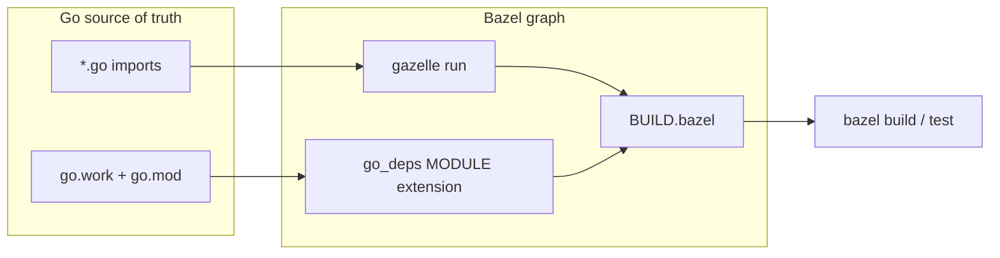
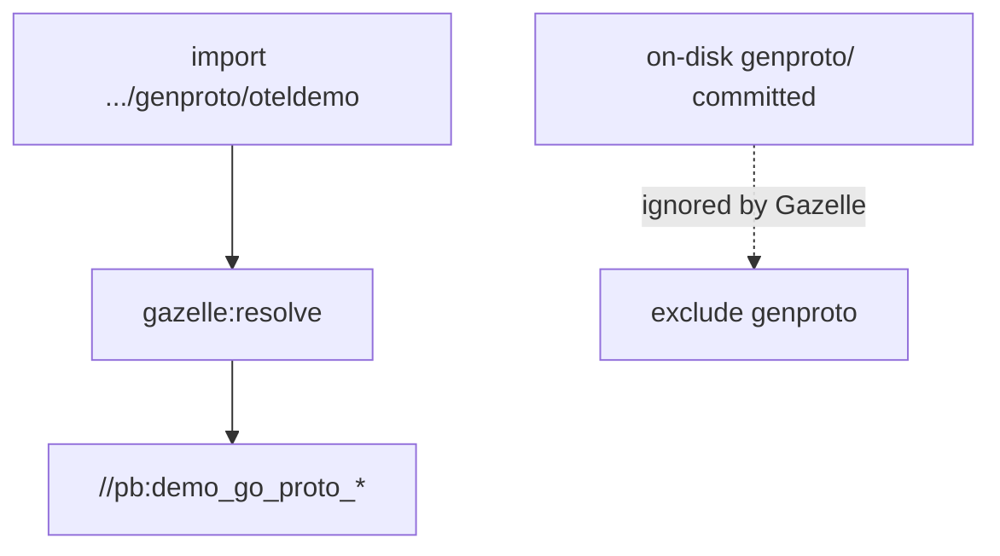

# Gazelle: how I stopped hand-writing `go_library` deps

Chapter **08** put **`demo.proto`** and **`go_proto_library`** in the graph. Your Go services still **import** generated packages by **string path** — e.g. `.../genproto/oteldemo`. **Gazelle** is the bridge: it scans `import` lines and writes **`deps = [...]`** into `BUILD.bazel` so you do not forget an edge and get a clean compile in CI but a broken graph in your head.

I am not sentimental about generated `BUILD` files. I am sentimental about **not** shipping a missing dependency because I “knew” the module layout.

---

## Bazel basics — what Gazelle is (and is not)

<table>
  <thead>
    <tr>
      <th>Piece</th>
      <th>Role</th>
    </tr>
  </thead>
  <tbody>
    <tr>
      <td><strong>Bazel</strong></td>
      <td>Executes the <strong>graph</strong> (<code>go_library</code>, <code>go_binary</code>, <code>go_test</code>). It does not guess your imports.</td>
    </tr>
    <tr>
      <td><strong><code>go.mod</code></strong> / <code>go.work</code></strong></td>
      <td>Tell the <strong>Go toolchain</strong> which modules exist and which versions of third-party code to use.</td>
    </tr>
    <tr>
      <td><strong>Gazelle</strong></td>
      <td>A <strong>code generator</strong> for Starlark: reads Go sources + module metadata, <strong>emits</strong> <code>BUILD.bazel</code> rules and <code>deps</code>.</td>
    </tr>
    <tr>
      <td><strong><code>go_deps</code></strong> (Bzlmod)</td>
      <td>Turns <strong><code>go.sum</code></strong> / <strong><code>go.work</code></strong> resolution into <strong><code>@com_github_...</code></strong> external repositories Bazel can depend on.</td>
    </tr>
  </tbody>
</table>



**Mental model:** after you change imports or add a file, you either **re-run Gazelle** or you **hand-edit** `BUILD.bazel` with the same discipline as production code. Most teams choose Gazelle for the boring parts.

---

## The command I run after touching Go

From the repo root (also documented on **`//:gazelle`** in the root `BUILD.bazel`):

<Terminal
  title="Shell"
  commands={[
    {
      command: "bazelisk run //:gazelle -- update src/checkout src/product-catalog",
      output: "",
    },
  ]}
/>

**Why narrow paths?** `update` with explicit directories keeps analysis **smaller** and diffs **localized**. You can run without paths for a full-repo sweep when you know what you are doing.

**Dry run (see what would change):**

<Terminal
  title="Shell"
  commands={[
    {
      command: "bazelisk run //:gazelle -- update -mode=diff src/checkout src/product-catalog",
      output: "",
    },
  ]}
/>

---

## `importpath` and `# gazelle:prefix` must match reality

Each **`go_library`** needs an **`importpath`** that matches what **`go list`** would report for that package. If Gazelle’s default prefix is wrong, generated rules point at the wrong module path and you get errors that look like “cannot find package” even though the file is on disk.

This repo sets **per-package directives** at the top of each service `BUILD.bazel`.

**Checkout** (note the hyphen in **`open-telemetry`** — that is what this module uses):

```8:10:src/checkout/BUILD.bazel
# gazelle:prefix github.com/open-telemetry/opentelemetry-demo/src/checkout
# gazelle:exclude genproto
# gazelle:resolve go github.com/open-telemetry/opentelemetry-demo/src/checkout/genproto/oteldemo //pb:demo_go_proto_checkout
```

**Product catalog** uses a **different** module path prefix (no hyphen in **`opentelemetry`** — upstream demo quirk you must not “fix” casually):

```6:8:src/product-catalog/BUILD.bazel
# gazelle:prefix github.com/opentelemetry/opentelemetry-demo/src/product-catalog
# gazelle:exclude genproto
# gazelle:resolve go github.com/opentelemetry/opentelemetry-demo/src/product-catalog/genproto/oteldemo //pb:demo_go_proto_product_catalog
```

If you ever merge or rename modules, **these three lines are the first place** the graph and `go test` disagree.

---

## Why `# gazelle:exclude genproto`

Docker/Make still generate **committed** trees under `src/*/genproto/`. Bazel, meanwhile, builds the **same** API from **`//pb:demo_go_proto_*`**. If Gazelle **also** tried to turn every file under `genproto/` into a `go_library`, you would get **duplicate symbols**, wrong `deps`, or fights over which library “owns” the package.

**Rule of thumb:** exclude generated trees that are **not** the Bazel-owned source of truth, and **`# gazelle:resolve`** the import string to the **`go_proto_library`** target.



---

## `go.work` + `go_deps.from_file` (Bzlmod)

The root **`go.work`** lists the two service modules. **`MODULE.bazel`** wires Gazelle’s extension:

```starlark
go_sdk.download(version = "1.25.0")

go_deps = use_extension("@gazelle//:extensions.bzl", "go_deps")
go_deps.from_file(go_work = "//:go.work")
use_repo(go_deps, "com_github_google_uuid", /* ... */)
```

Third-party imports in Go source become labels like **`@com_github_ibm_sarama//:sarama`**. Gazelle’s **`update`** pass aligns **`deps`** with those repos.

Full rationale for **downloaded SDK vs host**, **Go 1.25**, **`GOEXPERIMENT`**, and **`go.mod` parseability** lives in **`docs/bazel/go-toolchain.md`** — the inline summary:

- **`go_sdk.download`** avoids “host Go too old for `go_repository` fetch” pain.  
- **rules_go ≥ 0.56** (here **0.59.0**) avoids **`unknown GOEXPERIMENT`** on Go 1.25.  
- **`.bazelrc`** clears **`GOEXPERIMENT`** for actions/repos as defense in depth.

---

## Tiny test target I use as a compass

**`//src/checkout/money:money_test`** is small and fast. If the workspace, toolchain, and trivial `go_test` wiring are wrong, you learn it **before** you debug gRPC.

<Terminal
  title="Shell"
  commands={[
    {
      command: "bazelisk test //src/checkout/money:money_test --config=ci --config=unit",
      output: "",
    },
  ]}
/>

**`money`** pulls generated types from **`//pb`**; the test is tagged **`unit`**:

```3:17:src/checkout/money/BUILD.bazel
go_library(
    name = "money",
    srcs = ["money.go"],
    importpath = "github.com/open-telemetry/opentelemetry-demo/src/checkout/money",
    visibility = ["//visibility:public"],
    deps = ["//pb:demo_go_proto_checkout"],
)

go_test(
    name = "money_test",
    srcs = ["money_test.go"],
    embed = [":money"],
    deps = ["//pb:demo_go_proto_checkout"],
    tags = ["unit"],
)
```

Broader sweeps once money is green:

<Terminal
  title="Shell"
  commands={[
    {
      command: "bazelisk test //src/checkout/... //src/product-catalog/... --config=ci --config=unit",
      output: "",
    },
  ]}
/>

---

## When Gazelle and I disagree

<table>
  <thead>
    <tr>
      <th>Symptom</th>
      <th>Likely cause</th>
    </tr>
  </thead>
  <tbody>
    <tr>
      <td>Missing <code>deps</code> after <code>update</code></td>
      <td>Wrong <strong><code>gazelle:prefix</code></strong> or import path typo.</td>
    </tr>
    <tr>
      <td>Duplicate proto packages</td>
      <td>Forgot <strong><code>gazelle:exclude genproto</code></strong> or removed <strong><code>gazelle:resolve</code></strong>.</td>
    </tr>
    <tr>
      <td>Fetch errors during <code>mod</code> / build</td>
      <td>Host <strong><code>go</code></strong> too old; use <strong><code>go_sdk.download</code></strong> and CI <strong><code>setup-go</code></strong> aligned with <strong><code>go.work</code></strong>.</td>
    </tr>
    <tr>
      <td><code>unknown GOEXPERIMENT</code></td>
      <td>Upgrade <strong>rules_go</strong>; see <strong>go-toolchain</strong> doc.</td>
    </tr>
  </tbody>
</table>

---

## What honest Go targets unlock

With **Gazelle** keeping **`go_library` / `go_binary` / `go_test`** honest, the graph can carry **whole services** under Bazel — not just **`//pb`**.
