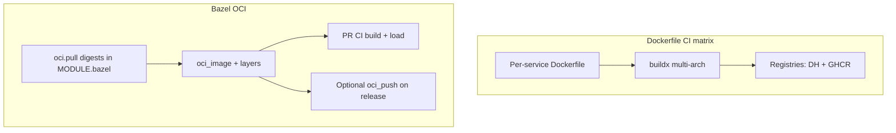

# OCI policy: living with two builders (Dockerfile matrix + Bazel `oci_image`)

I did **not** delete the Dockerfile-driven CI matrix. That is a **deliberate** product decision, not a failure to finish.

---

## Why two build tracks exist

<table>
  <thead>
    <tr>
      <th>Track</th>
      <th>Role</th>
    </tr>
  </thead>
  <tbody>
    <tr>
      <td><strong>Dockerfile matrix</strong> (reusable workflow + per-service Dockerfiles)</td>
      <td><strong>Published</strong> multi-arch images (<strong><code>linux/amd64</code></strong>, <strong><code>linux/arm64</code></strong>) to <strong>Docker Hub</strong> and <strong>GHCR</strong> — the path the wider demo ecosystem expects.</td>
    </tr>
    <tr>
      <td><strong>Bazel <code>oci_image</code> + <code>oci_load</code> (+ optional <code>oci_push</code>)</strong></td>
      <td><strong>PR-time proof</strong> on <strong>linux/amd64</strong>: reproducible layering, digest-pinned bases declared in <strong><code>MODULE.bazel</code></strong>, tests that catch “graph broke” before anyone tags a release.</td>
    </tr>
  </tbody>
</table>

**Interview framing:**

> “I separated **registry truth** (multi-arch, release mechanics) from **build-graph truth** (hermetic-ish Bazel proofs). Shrinking the matrix in favor of **`oci_push`** everywhere is a **phase-two** cost trade — I did not pretend it was free.”

---

## Technical choices I standardized on (Bazel side)

<table>
  <thead>
    <tr>
      <th>Topic</th>
      <th>Choice</th>
      <th>Why</th>
    </tr>
  </thead>
  <tbody>
    <tr>
      <td><strong>Rule set</strong></td>
      <td><strong><code>rules_oci</code></strong> from BCR</td>
      <td>Bzlmod-native, modern layering model.</td>
    </tr>
    <tr>
      <td><strong>Base images</strong></td>
      <td><strong><code>oci.pull</code></strong> + digest</td>
      <td>Reviewable pins; supply-chain clarity in module files.</td>
    </tr>
    <tr>
      <td><strong>Local tags</strong></td>
      <td><strong><code>:bazel</code></strong> suffix<strong> on <strong><code>oci_load</code></strong> repo tags</td>
      <td>Avoids colliding with Compose <strong><code>latest-*</code></strong> pulls on a developer laptop.</td>
    </tr>
  </tbody>
</table>

**Caveats I keep visible** (so nobody confuses “green in Bazel” with “pixel-identical to Dockerfile”):

- **load-generator**: Bazel image has **Python** Playwright deps — **not** **`playwright install`** browsers; full browser parity stays on the Dockerfile path.  
- **JVM services**: some Dockerfiles inject the **OTel Java agent** via **`JAVA_TOOL_OPTIONS`**; Bazel images may **omit** that unless you add a layer.  
- **accounting / cart / email / quote**: base distro or extension sets may **differ** from Alpine/musl Dockerfiles — on purpose where **glibc** or **rules_ruby** compatibility wins.  
- **Edge proxies**: Dockerfile path runs **`envsubst` at container start** so any env can rewrite upstreams; the Bazel path typically **bakes** Envoy YAML / nginx config at **build** time using defaults aligned with Compose DNS — to change upstreams in the Bazel image you **rebuild** with different bake inputs, or you use the Dockerfile for runtime substitution.

---

## Dockerfile vs Bazel — the matrix I actually maintain

This table is the **closure** of “what exists in both worlds” versus “Dockerfile only” in this fork:

<table>
  <thead>
    <tr>
      <th><code>tag_suffix</code> / service</th>
      <th>Dockerfile (matrix)</th>
      <th>Bazel targets (summary)</th>
      <th>Notes</th>
    </tr>
  </thead>
  <tbody>
    <tr>
      <td>accounting</td>
      <td><code>./src/accounting/Dockerfile</code></td>
      <td><code>//src/accounting:accounting_image</code>, <code>accounting_load</code></td>
      <td>Dual; publish = Dockerfile today.</td>
    </tr>
    <tr>
      <td>ad</td>
      <td><code>./src/ad/Dockerfile</code></td>
      <td><code>//src/ad:ad_oci_image</code>, <code>ad_oci_load</code></td>
      <td>Dual; JVM agent parity differs.</td>
    </tr>
    <tr>
      <td>cart</td>
      <td><code>./src/cart/src/Dockerfile</code></td>
      <td><code>//src/cart:cart_image</code>, <code>cart_load</code></td>
      <td>Dual; Bazel = FDD <strong>aspnet</strong> vs musl single-file Docker.</td>
    </tr>
    <tr>
      <td>checkout</td>
      <td><code>./src/checkout/Dockerfile</code></td>
      <td><code>checkout_image</code>, <code>checkout_load</code>, <strong><code>checkout_push</code></strong></td>
      <td>Dual; Bazel path includes <strong><code>checkout_push</code></strong> (<strong><code>oci_push</code></strong> pilot).</td>
    </tr>
    <tr>
      <td>currency</td>
      <td><code>./src/currency/Dockerfile</code></td>
      <td><code>currency_image</code>, <code>currency_load</code></td>
      <td>Dual.</td>
    </tr>
    <tr>
      <td>email</td>
      <td><code>./src/email/Dockerfile</code></td>
      <td><code>email_image</code>, <code>email_load</code></td>
      <td>Dual; Bazel base = Debian slim vs Alpine Docker.</td>
    </tr>
    <tr>
      <td>flagd-ui</td>
      <td><code>./src/flagd-ui/Dockerfile</code></td>
      <td><code>flagd_ui_image</code>, <code>flagd_ui_load</code></td>
      <td>Dual.</td>
    </tr>
    <tr>
      <td>fraud-detection</td>
      <td><code>./src/fraud-detection/Dockerfile</code></td>
      <td><code>fraud_detection_oci_image</code>, <code>fraud_detection_oci_load</code></td>
      <td>Dual.</td>
    </tr>
    <tr>
      <td>frontend</td>
      <td><code>./src/frontend/Dockerfile</code></td>
      <td><code>frontend_image</code>, <code>frontend_load</code></td>
      <td>Dual; <strong><code>next_build</code></strong> is <strong><code>manual</code></strong>.</td>
    </tr>
    <tr>
      <td>frontend-proxy</td>
      <td><code>./src/frontend-proxy/Dockerfile</code></td>
      <td><code>frontend_proxy_image</code>, <code>frontend_proxy_load</code></td>
      <td>Dual; Bazel bakes Envoy YAML.</td>
    </tr>
    <tr>
      <td>frontend-tests</td>
      <td><code>./src/frontend/Dockerfile.cypress</code></td>
      <td>—</td>
      <td><strong>Dockerfile only</strong> (Cypress).</td>
    </tr>
    <tr>
      <td>image-provider</td>
      <td><code>./src/image-provider/Dockerfile</code></td>
      <td><code>image_provider_image</code>, <code>image_provider_load</code></td>
      <td>Dual; Bazel bakes nginx.conf.</td>
    </tr>
    <tr>
      <td>kafka</td>
      <td><code>./src/kafka/Dockerfile</code></td>
      <td>—</td>
      <td><strong>Dockerfile only</strong>.</td>
    </tr>
    <tr>
      <td>llm</td>
      <td><code>./src/llm/Dockerfile</code></td>
      <td><code>llm_image</code>, <code>llm_load</code></td>
      <td>Dual.</td>
    </tr>
    <tr>
      <td>load-generator</td>
      <td><code>./src/load-generator/Dockerfile</code></td>
      <td><code>load_generator_image</code>, <code>load_generator_load</code></td>
      <td>Dual; Playwright caveat above.</td>
    </tr>
    <tr>
      <td>opensearch</td>
      <td><code>./src/opensearch/Dockerfile</code></td>
      <td>—</td>
      <td><strong>Dockerfile only</strong>.</td>
    </tr>
    <tr>
      <td>payment</td>
      <td><code>./src/payment/Dockerfile</code></td>
      <td><code>payment_image</code>, <code>payment_load</code></td>
      <td>Dual.</td>
    </tr>
    <tr>
      <td>product-catalog</td>
      <td><code>./src/product-catalog/Dockerfile</code></td>
      <td>Go <strong>binary</strong> in Bazel; <strong>no</strong> <code>oci_image</code> yet</td>
      <td>Dockerfile for publish.</td>
    </tr>
    <tr>
      <td>product-reviews</td>
      <td><code>./src/product-reviews/Dockerfile</code></td>
      <td><code>product_reviews_image</code>, <code>product_reviews_load</code></td>
      <td>Dual.</td>
    </tr>
    <tr>
      <td>quote</td>
      <td><code>./src/quote/Dockerfile</code></td>
      <td><code>quote_image</code>, <code>quote_load</code></td>
      <td>Dual; PECL extensions differ.</td>
    </tr>
    <tr>
      <td>recommendation</td>
      <td><code>./src/recommendation/Dockerfile</code></td>
      <td><code>recommendation_image</code>, <code>recommendation_load</code></td>
      <td>Dual.</td>
    </tr>
    <tr>
      <td>shipping</td>
      <td><code>./src/shipping/Dockerfile</code></td>
      <td><code>shipping_image</code>, <code>shipping_load</code></td>
      <td>Dual.</td>
    </tr>
    <tr>
      <td>traceBasedTests</td>
      <td><code>./test/tracetesting/Dockerfile</code></td>
      <td>—</td>
      <td><strong>Dockerfile only</strong> (Tracetest driver).</td>
    </tr>
  </tbody>
</table>

---

## Commands — proving the Bazel side locally

<Terminal
  title="Shell"
  commands={[
    {
      command: "bazelisk build //src/checkout:checkout_image --config=ci",
      output: "# Representative OCI proof (Go + distroless \u2014 friendly first target)",
    },
    {
      command: "bazelisk run //src/checkout:checkout_load --config=ci",
      output: "",
    },
    {
      command: "docker images | grep demo-checkout",
      output: "",
    },
    {
      command: "bash ./tools/bazel/ci/ci_full.sh",
      output: "# Heavy graph (same shape as the main CI Bazel script)",
    },
  ]}
/>

---

## Interview line

> “Dual-build is **intentional**: **multi-arch release** stays on **Dockerfiles**, while **Bazel** gives me **digest-pinned bases** and **CI-visible OCI builds**. I document **parity gaps** (agents, Playwright, musl vs glibc) instead of hiding them.”
